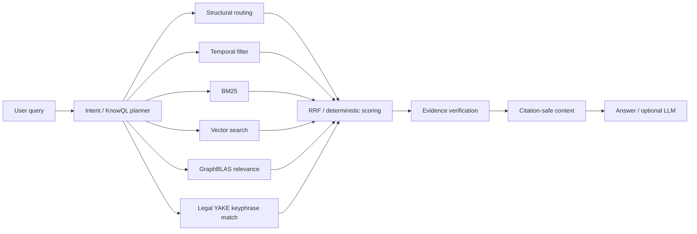
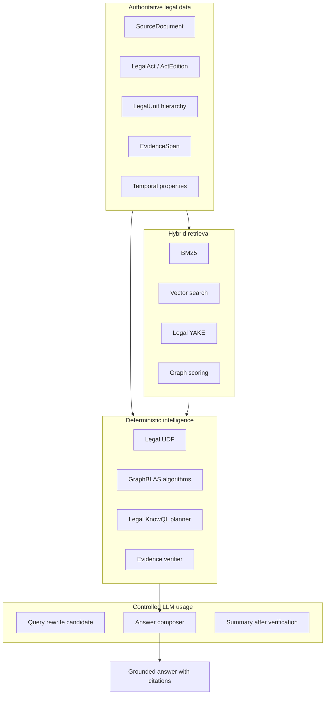

# 1. Общая идея

## Legal Knowledge Operating Layer для нормативных актов

Цель системы — построить не классический RAG «LLM поверх чанков», а **agentic temporal graph knowledge database** для нормативных актов на базе **FalkorDB**, где юридически значимые операции выполняются детерминированно, проверяемо и с точной ссылкой на источник.

Исходная задача: преобразовать нормативный акт, например 44-ФЗ в формате ODT (OpenDocument Text) из Гаранта, в графово-векторное представление, пригодное для:

- точного поиска по статьям, частям, пунктам и подпунктам;
- семантического поиска по смыслу нормы;
- temporal-фильтрации по редакции и датам действия;
- построения доказуемых ответов с юридическими цитатами;
- agentic reasoning без передачи LLM роли источника истины;
- масштабирования от одного закона к корпусу нормативных актов.

## Главный принцип

> LLM не принимает юридически значимых решений. Все проверяемые операции — структура, ссылки, редакции, действительность нормы, evidence, цитирование и базовый retrieval — должны выполняться алгоритмически через FalkorDB, GraphBLAS, UDF/procedures и формальный слой Legal KnowQL.

LLM может использоваться только как:

1. интерфейс естественного языка;
2. генератор объяснения на основе уже найденных и проверенных evidence;
3. fallback для неоднозначного intent parsing;
4. кандидатный extractor, результаты которого не считаются истинными без верификации.

## Почему обычный RAG недостаточен

Обычный pipeline:

```text
Document → chunks → embeddings → vector search → LLM answer
```

недостаточен для права, потому что:

- произвольный чанк не равен юридической норме;
- embedding не гарантирует правильную редакцию;
- LLM может придумать ссылку или перепутать статью;
- без evidence verification ответ нельзя считать юридически надежным;
- плоский поиск плохо масштабируется на большой корпус;
- пользователь должен видеть не только ответ, но и точную норму-источник.

## Целевой подход

Система должна строить **retrieval-ready, citation-safe, evidence-verifiable legal graph**.

```mermaid
flowchart TD
    A[ODT нормативного акта (Гарант)] --> B[Извлечение SourceBlocks]
    B --> C[Очистка и нормализация текста]
    C --> D[Юридическая структура: глава / статья / часть / пункт]
    D --> E[Temporal layer: редакция, valid_from, valid_to, status]
    D --> F[Evidence layer: EvidenceSpan и citation_label]
    D --> G[Semantic layer: NormStatement, LegalTerm, LegalSubject]
    D --> H[Vector layer: TextChunk + embeddings]
    G --> I[Legal Nexus / KnowQL]
    E --> I
    F --> I
    H --> I
    I --> J[Deterministic retrieval + verification]
    J --> K[Optional LLM composer]
    K --> L[Ответ с проверенными цитатами]
```

## Ключевые идеи, которые объединяет система

### 1. Graph-first

Закон представляется не как текстовый файл, а как граф:

```text
LegalAct → ActEdition → Chapter → Article → Part → Clause → SubClause → Paragraph
```

Каждая единица имеет:

- стабильный ID;
- путь (`path`);
- citation label;
- редакцию;
- temporal status;
- evidence-связь с исходным документом.

### 2. Temporal-first

Для юридической базы важно различать:

- `edition_date` — дата редакции документа;
- `valid_from` / `valid_to` — период действия нормы;
- `effective_from` / `effective_to` — период применения;
- `imported_at` — дата загрузки в базу знаний.

Нельзя считать, что вся норма действует с даты редакции. Temporal-логика должна быть отдельным проверяемым слоем.

### 3. Evidence-first

Любой ответ должен быть связан с доказательством:

```text
Answer → EvidenceSpan → LegalUnit → ActEdition → SourceDocument
```

Без evidence система должна возвращать `no_answer`, а не генерировать уверенный ответ.

### 4. Deterministic-first

Там, где ответ можно получить алгоритмически, LLM не используется:

- найти статью по номеру;
- проверить статус нормы;
- разрешить ссылку `п. 4 ч. 1 ст. 31 44-ФЗ`;
- получить дату редакции;
- найти определение термина;
- проверить наличие evidence;
- построить citation label.

### 5. Hybrid retrieval

Поиск должен объединять:

- структурный routing по графу;
- BM25 / full-text для точных юридических терминов;
- vector search для семантики;
- YAKE!/Legal YAKE для объяснимых ключевых фраз;
- GraphBLAS scoring для релевантности в графе;
- temporal filter;
- evidence verification.



## Роль Legal YAKE

Legal YAKE — это lightweight explainability layer. Он не заменяет embeddings и граф, но помогает:

- извлекать ключевые фразы из статей, частей и пунктов;
- создавать `KeyPhrase` и `AutoTag` nodes;
- улучшать reranking без тяжелого neural reranker;
- контролировать качество чанкинга;
- строить explainable retrieval report;
- генерировать кандидаты для `LegalConcept` и `NormStatement`.

## Роль Legal Nexus и KnowQL

Legal Nexus реализован как Python-модуль (`LegalNexus` класс), который:

- принимает пользовательский вопрос или KnowQL-запрос;
- строит deterministic query plan;
- вызывает FalkorDB Cypher, GraphBLAS и UDF;
- формирует verified evidence pack;
- ограничивает роль LLM.

UDF в FalkorDB пишутся на JavaScript (простые graph-операции), сложная оркестрация — в Python LegalNexus.

Legal KnowQL — декларативный язык юридических запросов:

```sql
FIND requirements
FOR subject "участник закупки"
IN act "44-ФЗ"
AT date "2025-12-28"
RETURN norm, citation, evidence
```

## Целевая формула надежности

```text
Legal Graph precision
+ Vector semantic recall
+ BM25 exact matching
+ Legal YAKE explainability
+ GraphBLAS relevance propagation
+ Temporal filtering
+ Evidence verification
+ Deterministic UDF
+ Extensible graph model
+ ODT/odfpy ingestion
= reliable agentic legal knowledge database
```

### 6. Extensible-first

Граф-модель проектируется для гетерогенных источников:

- `LegalDocument` как базовый тип с подтипами (`LegalAct`, `CaseLaw`, `PracticeDocument`);
- `ContentDomain` как первоклассный концепт для разделения нормативных актов, судебной практики, ФАС и отраслевых доменов;
- ETL-пайплайн параметризован: `document_type` задаётся при загрузке, ядро не требует изменений.

## Итоговая идея

Система должна стать **Legal Knowledge Operating Layer** поверх FalkorDB:



## Roadmap контента

```text
Фаза 1: Нормативные акты
  - 44-ФЗ, 223-ФЗ, ГК РФ
  - ODT-парсинг, базовая структура, temporal

Фаза 2: Судебная практика + ФАС
  - Постановления, решения, определения
  - ContentDomain: case_law, fas_practice

Фаза 3: Проверки и контроль
  - Плановые/внеплановые проверки
  - Relationship: subject_to_audit

Фаза 4: Отраслевые домены
  - Закупки, строительство, здравоохранение
  - ContentDomain: sectoral_regulation

Фаза 5: Бюджетный учёт
  - Бюджетный кодекс, сопутствующие акы
  - Интеграция с учётными системами
```
