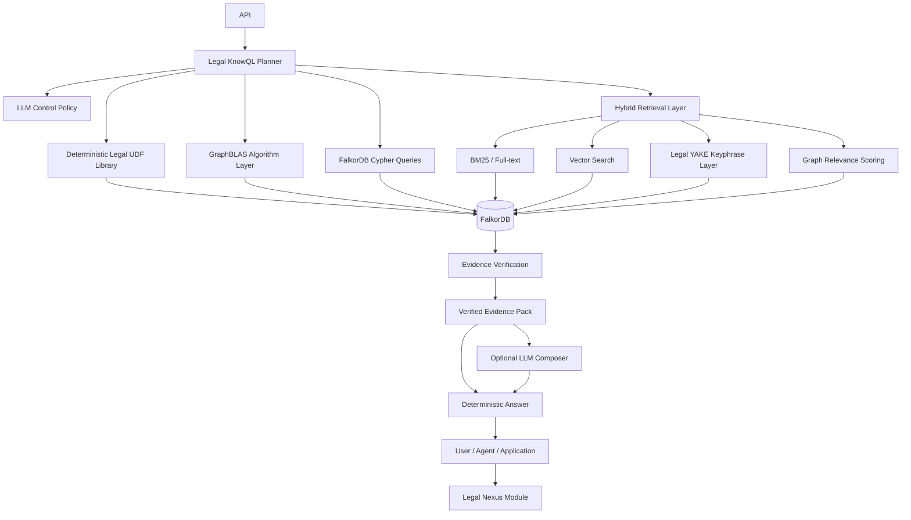
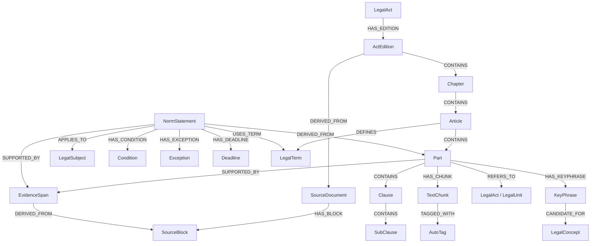
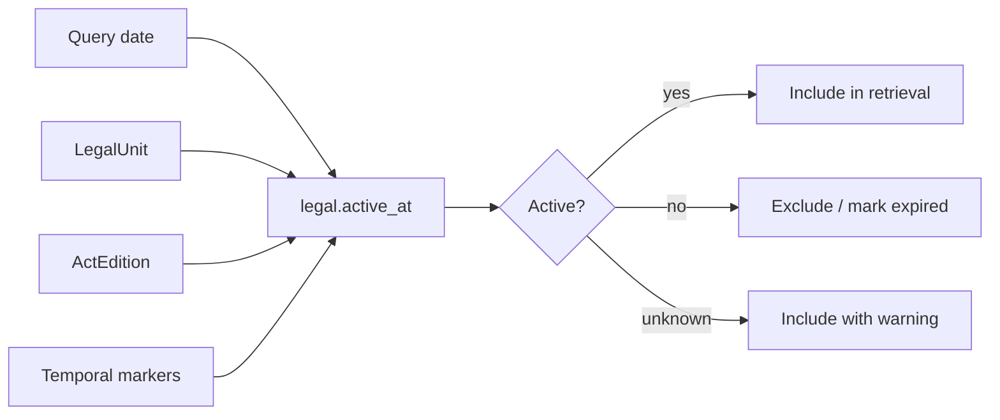
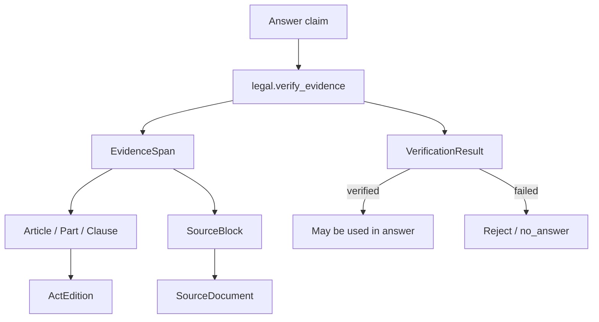
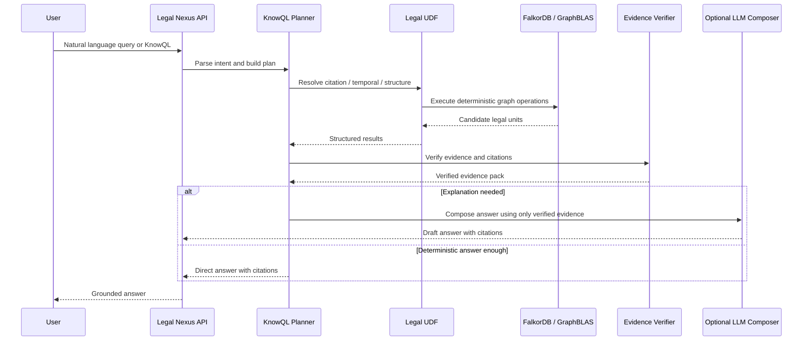
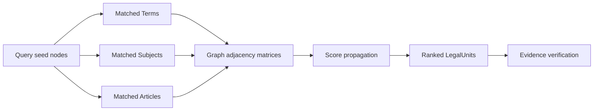
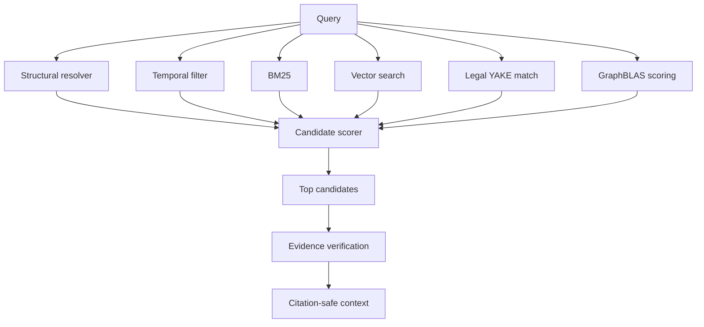
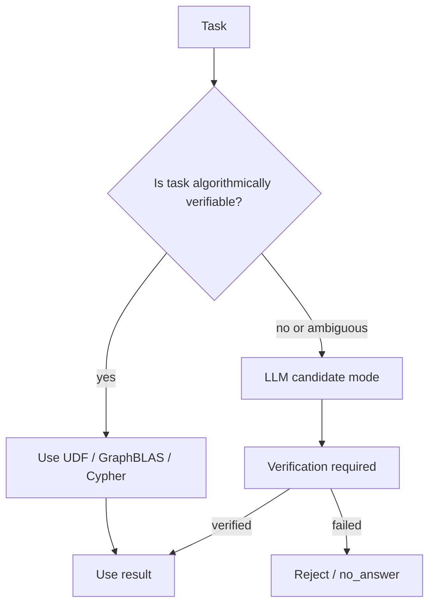
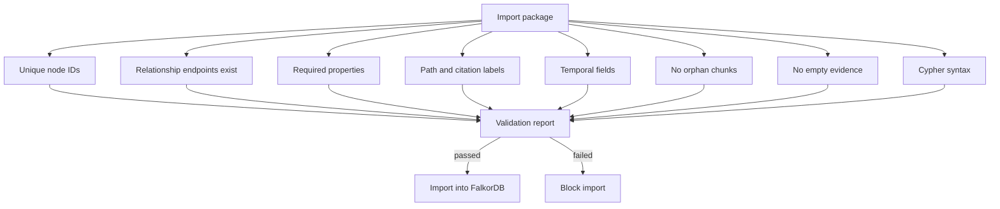

# 2. Архитектура системы

## Назначение

Архитектура описывает систему подготовки, хранения и использования нормативных актов в **FalkorDB agentic temporal graph knowledge database** с дополнительным слоем **Legal Nexus + Legal KnowQL**.

Главная задача архитектуры — минимизировать влияние LLM на юридически проверяемых участках и заменить его:

- графовыми структурами FalkorDB;
- GraphBLAS-алгоритмами;
- детерминированными UDF/procedures;
- формальным query planning;
- evidence verification;
- citation-safe retrieval.

## High-level architecture



## Основные слои

### 1. Ingestion / ETL Layer

Отвечает за преобразование исходного ODT (OpenDocument Text) в нормализованные блоки и графовые сущности.

Вход:

- ODT-файл нормативного акта;
- имя файла;
- MIME type: `application/vnd.oasis.opendocument.text`;
- источник: Гарант;
- дата импорта.

Выход:

- `SourceDocument`;
- `SourceBlock`;
- cleaned text;
- legal structure;
- evidence spans;
- graph nodes and relationships;
- import package для FalkorDB.

```mermaid
flowchart TD
    A[ODT файл (Гарант)] --> B[Source metadata + SHA-256]
    B --> C[ODT block extractor (odfpy)]
    C --> D[SourceBlock JSONL]
    D --> E[Text cleaner]
    E --> F[Metadata extractor]
    E --> G[Structure parser]
    G --> H[Temporal extractor]
    G --> I[Reference extractor]
    G --> J[Term / entity extractor]
    G --> K[NormStatement extractor]
    G --> L[Legal YAKE extractor]
    G --> M[Chunk builder]
    H --> N[FalkorDB export package]
    I --> N
    J --> N
    K --> N
    L --> N
    M --> N
```

### 2. Authoritative Graph Layer

FalkorDB хранит authoritative legal graph.

Основные labels:

```text
SourceDocument
SourceBlock
LegalAct
ActEdition
Chapter
Article
Part
Clause
SubClause
Paragraph
EvidenceSpan
TextChunk
NormStatement
LegalTerm
LegalSubject
LegalConcept
Condition
Exception
Deadline
Reference
KeyPhrase
AutoTag
```

Основные relationships:

```text
HAS_EDITION
DERIVED_FROM
CONTAINS
NEXT
PREVIOUS
SUPPORTED_BY
LOCATED_IN
HAS_CHUNK
DEFINES
USES_TERM
REFERS_TO
APPLIES_TO
HAS_CONDITION
HAS_EXCEPTION
HAS_DEADLINE
HAS_KEYPHRASE
TAGGED_WITH
CANDIDATE_FOR
VERSION_OF
SUPERSEDES
AMENDED_BY
```

## Целевая графовая модель



## 3. Temporal Layer

Temporal layer отвечает за применимость норм во времени.

Каждая юридическая единица должна иметь:

```json
{
  "edition_date": "2025-12-28",
  "valid_from": null,
  "valid_to": null,
  "effective_from": null,
  "effective_to": null,
  "status": "active",
  "temporal_confidence": "unknown"
}
```

Статусы:

```text
active
expired
future
partially_active
unknown
```

Temporal-проверка выполняется детерминированно через UDF:

```text
legal.active_at(node_id, date) → active / inactive / unknown
```



## 4. Evidence Layer

Evidence layer нужен для grounding.

Основная цепочка доказательства:

```text
NormStatement / TextChunk / Answer
  → EvidenceSpan
  → LegalUnit
  → SourceBlock
  → SourceDocument
```



## 5. Legal Nexus Layer

Legal Nexus — orchestration layer между пользователем, агентом и FalkorDB.

Функции:

- intent detection;
- KnowQL parsing;
- deterministic query planning;
- вызов UDF;
- запуск GraphBLAS algorithms;
- hybrid retrieval;
- evidence verification;
- формирование citation-safe context;
- контроль использования LLM.

## 6. Legal KnowQL

Legal KnowQL — декларативный DSL для юридических запросов.

Примеры:

```sql
GET norm
WHERE act = "44-ФЗ"
AND article = "31"
AND part = "1"
AT "2025-12-28"
RETURN text, status, citation, evidence
```

```sql
FIND norm_statements
WHERE norm_type = "requirement"
AND subject = "участник закупки"
IN act = "44-ФЗ"
AT "2025-12-28"
RETURN statement, source_path, evidence
```

```sql
CHECK validity
OF "п. 4 ч. 1 ст. 31 44-ФЗ"
AT "2025-12-28"
RETURN status, temporal_evidence
```

## KnowQL execution flow



## 7. Deterministic UDF Library

Ключевые процедуры:

```text
legal.resolve_citation(citation, edition_date)
legal.active_at(node_id, date)
legal.get_norm(act, article, part, clause, date)
legal.get_article(act, article, edition_date)
legal.get_definition(term, date)
legal.find_requirements(subject, act, date)
legal.find_obligations(subject, act, date)
legal.find_prohibitions(subject, act, date)
legal.find_exceptions(scope, date)
legal.find_deadlines(scope, date)
legal.expand_references(node_id, depth, date)
legal.verify_evidence(claim, evidence_id)
legal.rank_candidates(query, candidates, date)
legal.build_context(query, candidates, max_scope)
legal.format_citation(node_id)
```

## 8. GraphBLAS Algorithm Layer

GraphBLAS используется для вычислимых графовых операций:

- controlled graph expansion;
- relevance propagation;
- reference closure;
- temporal subgraph filtering;
- graph-distance scoring;
- concept-neighborhood search;
- centrality scoring for norms;
- orphan node detection;
- duplicate / near-duplicate detection.

Пример relevance propagation:



## 9. Hybrid Retrieval Layer

Retrieval состоит из нескольких источников сигналов.

```text
final_score =
    0.25 * structural_match
  + 0.20 * graph_relevance
  + 0.15 * bm25_score
  + 0.15 * vector_score
  + 0.10 * yake_keyphrase_match
  + 0.10 * temporal_validity
  + 0.05 * evidence_confidence
```



## 10. LLM Control Policy

LLM output is non-authoritative.

LLM запрещен для:

- structural lookup;
- temporal validity;
- citation resolution;
- evidence verification;
- status checks;
- source existence checks.

LLM разрешен для:

- natural language explanation;
- query rewrite candidate;
- ambiguous intent clarification;
- summarization of verified evidence;
- candidate semantic extraction with verification.



## 11. Import Package Architecture

Пакет импорта в FalkorDB:

```text
01_source_document.json
02_legal_act.json
03_source_blocks.jsonl
04_structure_nodes.jsonl
05_evidence_nodes.jsonl
06_norm_nodes.jsonl
07_entity_nodes.jsonl
08_term_nodes.jsonl
09_chunk_nodes.jsonl
10_keyphrase_nodes.jsonl
11_relationships.jsonl
12_embeddings.jsonl
13_import.cypher
14_validation_report.json
15_quality_report.json
16_retrieval_eval.json
17_cleaned.md
```

## 12. Validation Architecture

Перед импортом система должна валидировать пакет.



## 13. Deployment view

```mermaid
flowchart TB
    subgraph ETL[ETL Runtime]
        E1[ODT Parser (odfpy)]
        E2[Structure Parser]
        E3[Legal YAKE]
        E4[Exporter]
    end

    subgraph DB[FalkorDB]
        D1[Graph Store]
        D2[Vector Properties / External Vector IDs]
        D3[Indexes]
    end

    subgraph Nexus[Legal Nexus Service]
        N1[KnowQL Parser]
        N2[Query Planner]
        N3[UDF Gateway]
        N4[GraphBLAS Runner]
        N5[Evidence Verifier]
    end

    subgraph Optional[Optional Services]
        O1[Embedding Model]
        O2[LLM Composer]
    end

    ETL --> DB
    Nexus --> DB
    Nexus --> Optional
    Optional --> Nexus
```

## 13b. Deployment Evolution

Поэтапный переход:

```text
Этап 1: FalkorDBLite (embedded)
  - Локальный режим без Docker
  - pip install falkordblite
  - Быстрый старт для разработки

Этап 2: Docker Compose
  - FalkorDB в контейнере
  - Персистентное хранение
  - Один docker-compose up

Этап 3: Python-модуль → FastAPI-обёртка
  - LegalNexus как Python-класс
  - REST API для integration
  - OpenAPI docs
```

## 13c. UDF Architecture

Два уровня UDF:

### JavaScript UDF в FalkorDB (простые graph-операции)

```javascript
legal.active_at(node_id, date)     // проверка temporal status
legal.format_citation(node_id)     // форматирование цитаты
legal.get_norm_id(act, article)    // быстрый lookup
```

Загружаются через `GRAPH.UDF LOAD`.

### Python методы в LegalNexus (сложная оркестрация)

```python
class LegalNexus:
    def legal_find_requirements(self, subject, act, date):
        # orchestration + graph traversal + evidence gathering

    def legal_verify_evidence(self, claim, evidence_ids):
        # multi-step verification

    def legal_build_context(self, query, candidates):
        # context assembly for LLM
```

## 13d. Embedding Stack

```text
Model: sentence-transformers + deepvk/USER-bge-m3
Dimension: 1024
Language: optimized for Russian

Vector store: FalkorDB vector index
  - cosine similarity
  - dimension: 1024
  - no external vector store required
```

## 13e. Extensible Graph Model

```text
LegalDocument (base type)
  ├── LegalAct (federal law, law, decree)
  ├── CaseLaw (court decision, ruling, determination)
  └── PracticeDocument (fas_practice, audit_report, explanation)

ContentDomain (first-class concept)
  - normative_acts
  - case_law
  - fas_practice
  - procurement
  - construction
  - healthcare
  - budget_accounting
```

ETL параметризован: `document_type` задаётся при загрузке, ядро не требует изменений.

## 13f. Rust Roadmap

```text
Долгосрочная цель: ETL-компоненты через PyO3

В MVP: только Python
  - Быстрая итерация
  - Простая отладка
  - Быстрый старт

Post-MVP: Rust для критичных ETL-компонентов
  - Парсинг ODT (через odfpy остаётся Python)
  - CPU-intensive text processing
  - PyO3 bindings
```

## 14. Архитектурный итог

Система реализует deterministic-first legal intelligence architecture:

- FalkorDB — authoritative legal knowledge substrate;
- FalkorDBLite → Docker Compose — deployment evolution;
- ODT/odfpy ingestion — source format from Гарант;
- sentence-transformers + deepvk/USER-bge-m3 — embeddings (1024-dim);
- FalkorDB vector index — cosine similarity, no external vector store;
- Legal Nexus Module — Python-класс для orchestration;
- JS UDF в FalkorDB — простые graph-операции;
- Python LegalNexus — сложная оркестрация;
- Legal KnowQL — формальный язык запросов;
- GraphBLAS — вычислимое графовое reasoning ядро;
- UDF/procedures — проверяемая юридическая логика;
- Legal YAKE — легкий explainable semantic layer;
- Extensible graph model — LegalDocument + ContentDomain;
- LLM — non-authoritative language interface.
