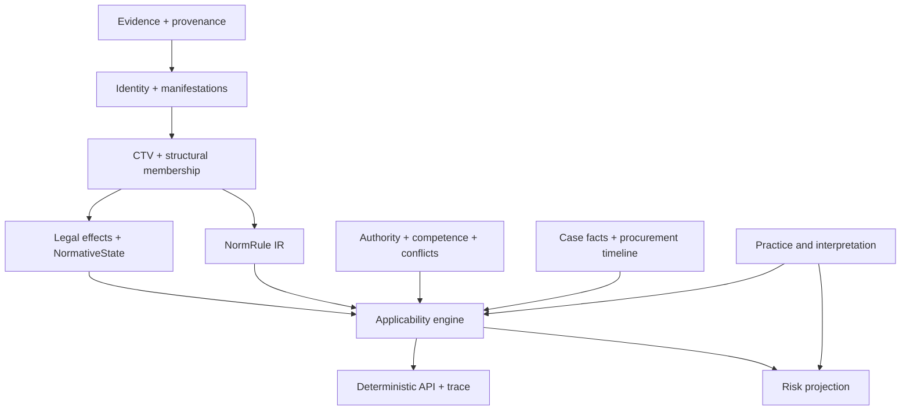

# Вывод

Да, **следующим основным шагом должно стать проектирование будущей темпоральной юридической онтологии**. Но начинать следует не с OWL-классов, графовой схемы или Rust-типов, а с отдельного этапа:

> **Ontology Requirements & Semantic Specification** — формализация юридических вопросов, понятий, инвариантов, временной алгебры, правил применимости, детерминированного API и проверочных дел.

Текущий `main` — `1092ef435947d74080818f69dd08dbb27bfb8f9c` от 12 августа 2026 года. Последний GitHub Actions run завершён успешно; публичный CI проверяет Rust formatting/check/clippy/tests и Python repository-control gates.  

После предыдущей оценки сделан большой шаг: между старой и текущей ревизиями — 50 коммитов, в основном по продуктовой документации, ADR, assessment/governor и трассируемости. При этом Rust product runtime практически не изменялся. Это означает, что **документационный долг закрыт, но следующий цикл должен быть семантическим и продуктовым, а не ещё одной волной governance**. 

---

# 1. Что исправлено после предыдущей оценки

## Закрыто или существенно улучшено

| Предыдущее замечание | Текущее состояние |
|---|---|
| Не было современного PRD/Product Contract | Добавлены `prd/PRODUCT.md` и `prd/REQUIREMENTS.md` |
| Архитектурный oracle ссылался на локальные `.gsd` как на публичную основу | `.gsd/**` явно объявлен локальным workflow state |
| Applicability считалась профильной обязанностью | ADR-0023 передал decision/abstention/trace нейтральному core |
| Temporal readiness сводилась к одному `GATE-G005` | Появились `TL-G01–TL-G12` с graduation criteria |
| Не было единого словаря | Добавлен controlled glossary и vocabulary governance |
| Семантические пробелы могли исчезнуть после исправления документации | Добавлен `TSG-001–TSG-016` gap register |
| Не было parser corpus acceptance protocol | Добавлена лестница G0–G3; честно зафиксировано текущее состояние G1 |
| Не различались publication и observation в transaction-time wording | Уточнены независимые clock roles |
| Practice могла читаться как «шестые часы» | Уточнено: first-class temporality поверх пяти часов |
| Industry priority могла выглядеть как изменение ранга | Уточнено: profile input, но не rank elevation |
| Не было формального Product → Requirement → ADR trace | Добавлены `PC-001–020` и `RQ-001–020` |

`PRODUCT.md` теперь содержит personas, user loops, typed inputs/outputs, legal-error threat model, human authority boundary, capability/quality clauses и трассировку в требования. Это уже настоящий продуктовый контракт, хотя он сознательно остаётся `[proposed]`. 

`REQUIREMENTS.md` отделяет опубликованные продуктовые требования от локального GSD и устанавливает правильную формулу ограничения lifecycle:

```text
lifecycle(requirement)
≤ lifecycle(product clause)
≤ lifecycle(governing ADR and proof)
```


ADR-0023 исправил наиболее принципиальный прежний дефект: профиль закупок предоставляет версионированные факты, классификаторы и predicate declarations, но **не может самостоятельно принять решение о применимости**. Решение, abstention и `ExplainableTrace` принадлежат нейтральному core. 

Это соответствует ранее предложенной архитектуре:

```text
Temporal Text Graph
+ Normative Rule Graph
+ Procurement Case Graph
+ Deterministic Legal API
```


---

# 2. Скорректированная оценка

| Область | Раньше | Сейчас |
|---|---:|---:|
| Публичный Product Contract / PRD | 4.5/10 | **8/10** |
| Документационная целостность | 5/10 | **8.5/10** |
| ADR/governance | 8/10 | **9/10** |
| Концептуальная темпоральная модель | 7/10 | **7.5/10** |
| Разделение text / force / applicability / knowledge | 4/10 | **7/10** |
| Applicability architecture | 3.5/10 | **6/10** |
| Нормативная семантика / NormRule | 4.5/10 | **5/10** |
| Закупочная специализация | 2.5/10 | **4/10** |
| Parser evidence | 4/10 | **5/10 — G1** |
| Roadmap как current-front plan | 4/10 | **5/10** |
| Исполняемая темпоральная онтология | 2/10 | **2/10** |
| Внешняя open-source готовность | — | **3/10** |

Итог следует разделять:

- **зрелость архитектурной документации:** около **8/10**;
- **зрелость юридико-семантической модели:** около **6/10**;
- **зрелость исполняемой темпоральной системы:** около **2–3/10**.

Предыдущая интегральная оценка была примерно 5.5/10.  Сейчас проект заметно продвинулся, но главным образом **от неструктурированного архитектурного замысла к хорошо контролируемой спецификации пробелов**, а не к исполняемому юридическому движку.

---

# 3. Что пока не закрыто

Сильная сторона текущего состояния в том, что проект сам перечисляет незакрытые вопросы. `temporal-legal-model.md` признаёт:

- entity model — partial;
- event taxonomy — undefined;
- temporal algebra — partial;
- applicability DSL — undefined;
- deterministic API — absent;
- unified error taxonomy — absent;
- golden corpus — только 18 paper cases;
- correction, conflict, provenance и status — partial. 

Gap register раскладывает это на 16 конкретных задач, включая:

- `TSG-002` — `TextChangeEvent` против `NormativeEffectEvent`;
- `TSG-003` — CTV split/merge/move/renumber;
- `TSG-004` — dimensional separation `NormativeState`;
- `TSG-005` — `NormRule` IR;
- `TSG-006` — applicability runtime;
- `TSG-007` — competence/delegation graph;
- `TSG-008` — practice coverage;
- `TSG-010` — procurement case graph и классификаторы;
- `TSG-011` — correction ledger;
- `TSG-012` — temporal references;
- `TSG-013` — structural membership;
- `TSG-014` — API и errors;
- `TSG-015` — executable gold cases. 

## Критичные остаточные вопросы

### 3.1. `temporal-legal-model.md` пока является crosswalk, а не полной спецификацией

Он хорошо:

- reconciles terminology;
- фиксирует ownership;
- перечисляет gates;
- запрещает преждевременное создание типов.

Но ещё не определяет:

- полный набор сущностей и отношений;
- идентичность каждой сущности;
- cardinalities;
- event taxonomy;
- interval algebra;
- applicability expression model;
- API schemas;
- error compatibility;
- machine-executable invariants.

Это правильный документ-предохранитель, но не финальная Ontology Requirements Specification. 

### 3.2. O1–O7 лучше превратить из линейной цепочки в dependency DAG

Сейчас модель представлена как:

```text
identity
→ CTV
→ state
→ conflict
→ practice
→ transition/risk
→ profiles
→ applicability boundary
```

Но реальные зависимости нелинейны:

- profiles снабжают inputs для conflict, applicability, practice и risk;
- practice не является «слоем над conflict» в обычном смысле;
- risk не должен быть частью transitional resolver;
- `NormRule` и applicability отсутствуют внутри O1–O7;
- correction и provenance являются сквозными плоскостями.

Предпочтительная форма:



O1–O7 можно сохранить как исторические идентификаторы, но архитектурный документ должен показывать реальную зависимость-множество, а не один стек.

### 3.3. `NormativeState` всё ещё смешивает разные измерения

В ADR-0018 остались:

```text
InForce
Suspended
Repealed
Superseded
Transitional
Unknown
```


При этом:

- `InForce/Suspended/Repealed` — force state;
- `Superseded` — version relation;
- `Transitional` — applicability mode;
- `Unknown` — epistemic outcome.

До фиксации Rust-типа это необходимо разделить:

```text
ForceState
VersionRelation
ApplicabilityOutcome
KnowledgeOutcome
```

Иначе будущий resolver получит логически невозможные переходы и сложные комбинации состояний.

### 3.4. ADR-0021 по-прежнему объединяет transition и risk

Добавлен правильный запрет: risk не выбирает версию, transition не решает applicability. Но ownership и lifecycle всё ещё находятся в одном ADR. 

Рекомендуется:

- ADR-0021 оставить за transitional resolution;
- создать отдельный ADR для advisory risk;
- risk отложить до появления применимости и practice coverage.

### 3.5. Normative hierarchy пока остаётся линейной

ADR-0019 по-прежнему основывается на `NormativeRank` и последовательности maxims. 

Для реального российского регулирования необходимы:

```text
Authority
Competence
Jurisdiction
TerritorialScope
Delegation
AuthorizedBy
Implements
MustConformTo
Specializes
Overrides
```

Это уже признано в `TSG-007`, но должно быть принято как архитектурное решение до реализации conflict resolver.

### 3.6. Practice coverage ещё не типизирован

ADR-0020 всё ещё говорит, что отсутствие практики означает отсутствие active overlay. 

Нужно различать:

```text
ApplicablePracticeFound
NoApplicablePracticeFound
CorpusCoverageUnknown
SearchIncomplete
ConflictingPractice
SupersededPractice
```

Иначе неполный поиск будет выглядеть как отсутствие правовой позиции.

### 3.7. Procurement profile пока только декларативный

ADR-0022 правильно ограничивает профиль read-only inputs, но пока нет:

- `ProcurementCase`;
- timeline событий закупки;
- временного статуса заказчика;
- версии положения о закупке;
- режима 44-ФЗ/223-ФЗ;
- версии перечней и кодов;
- traced regime resolution. 

---

# 4. Несколько конкретных дефектов текущего HEAD

Они небольшие по сравнению с уже закрытым долгом, но их стоит устранить перед фиксацией нового baseline.

## 4.1. README неверно пересказывает пять часов

README говорит о:

> source, publication, legal-effective, observed and system-transaction time


Canonical ADR определяет:

```text
factual_event
proceeding
legal_act_effect
source_publication
system_observation
```


Это семантический drift прямо на главной странице. Следует использовать точные canonical names.

## 4.2. Активные ADR всё ещё ссылаются на отсутствующие основания

Например, ADR-0016 ссылается на:

```text
prd/research/ontology_architecture_requirements/...
```


Но активный `prd/` больше не содержит `research/`. 

ADR-0022 также ссылается на `AGENTS.md rule #5`, хотя публичный root не содержит `AGENTS.md`.  

Решение:

- перенести нормативную формулировку непосредственно в ADR/Product Requirement;
- архивные исследования указывать как `archive-only prior art`;
- не оставлять untracked/local file единственным основанием active decision.

## 4.3. Roadmap всё ещё не является current-front планом

`project-state/roadmap.md` теперь честно отражает M165 и assessment front, но остаётся в основном исторической хроникой. В downstream table даже сохранилась дублирующая строка HC-15.  

`forward-roadmap.md` официально заморожен как historical M131–M140 plan. 

Следовательно, у проекта пока нет короткого активного плана после M165.

---

# 5. Каким должен быть следующий этап

## Не «сразу разработать онтологию», а сначала принять Ontology Requirements Baseline

Рекомендуемая цепочка:

```text
Product Goal
→ User Decision
→ Competency Question
→ Semantic Requirement
→ Entity / Relation / Invariant
→ Resolver / API
→ Golden Case
→ Proof Gate
```

Для каждого будущего элемента онтологии должна существовать причина, выраженная в виде конкретного юридического вопроса.

## Отдельная трассировка требований

Текущая трассировка заканчивается примерно так:

```text
PC → RQ → ADR
```

Для онтологии её нужно расширить:

```text
PC/RQ
→ CQ-###      competency question
→ SEM-###     semantic requirement
→ INV-###     invariant
→ SHAPE-###   structural constraint
→ API-###     deterministic operation
→ GOLD-###    positive/hostile legal case
→ EVID-###    proof artifact
```

Это не следует смешивать с обычными product requirements.

---

# 6. Обязательные разделы будущей спецификации

## 6.1. Scope и competency questions

Необходимо сформировать 40–60 вопросов, распределённых по группам:

1. идентичность акта и компонента;
2. реконструкция текста;
3. законодательные изменения;
4. юридическое действие и статус;
5. переходные положения;
6. применимость к делу;
7. нормативная иерархия;
8. ссылки;
9. практика;
10. correction/as-known-at;
11. закупочный режим;
12. explainability и abstention.

Примеры:

- Какая редакция части статьи существовала на дату события?
- Какой акт и какое положение создали эту редакцию?
- Была ли норма в силе или только опубликована?
- Применялась ли она к извещению, размещённому до даты вступления изменений?
- Какое переходное положение сохранило старую редакцию?
- Какой режим — 44-ФЗ, 223-ФЗ или специальная комбинация — применим?
- Какая версия положения о закупке действовала?
- Какая версия позиции перечня или классификатора применялась?
- На какую историческую редакцию указывала ссылка?
- Какой источник компетенции разрешал органу принять подзаконную норму?
- Обнаружена ли практика или покрытие корпуса неизвестно?
- Почему система вернула `Abstain`?

## 6.2. Canonical entity model

Для каждой сущности требуется определить:

- смысл;
- identity;
- lifecycle;
- cardinalities;
- temporal semantics;
- source authority;
- owner;
- allowed relations;
- invalid states;
- positive и counterexample.

Минимальные модули:

```text
EvidenceAssertion
LegalResource
Expression
Manifestation
ComponentConcept
ComponentVersion
StructuralMembershipVersion
LegislativeEvent
TextChangeEvent
NormativeEffectEvent
NormRule
NormativeState
Authority
Competence
Jurisdiction
ApplicabilityPredicate
CaseFact
ApplicabilityDecision
PracticeClaim
PracticeCoverageOutcome
CorrectionObservation
ExplainableTrace
```

## 6.3. Temporal algebra

Нужно формально определить:

- point и interval;
- открытые/закрытые границы;
- неопределённую точность дат;
- partially ordered events;
- event-to-interval derivation;
- retroactivity;
- prospective effect;
- suspension/resumption;
- correction versus legal change;
- source-publication as-of;
- system-observation as-of;
- scope-aware reconstruction;
- conflict of same-date events.

Пять clocks следует сохранить как **role-bound anchors**, но поверх них должна появиться алгебра событий и интервалов.

## 6.4. Event taxonomy

Сначала принять на бумаге:

```text
Enactment
OfficialPublication
TextInsertion
TextReplacement
TextRepeal
Renumber
Move
Split
Merge
Correction
EntryIntoForce
ApplicabilityOnset
Suspension
Resumption
Expiry
Repeal
Invalidation
ExTuncEffect
```

Ключевой инвариант:

```text
TextChangeEvent ≠ NormativeEffectEvent
```

## 6.5. NormRule IR

Ontology не должна приравнивать текст положения к норме.

Минимальный IR:

```text
NormRule
├── source spans
├── modality
├── addressee
├── action
├── object
├── conditions
├── exceptions / defeaters
├── temporal scope
├── jurisdiction / competence
├── legal consequence
├── priority relations
└── provenance and review status
```

LLM output должен оставаться `ProposedRuleCandidate`, а не `NormRule`.

## 6.6. Applicability DSL

Вместо одного `effective_from`:

```text
EventOnOrAfter(NoticePublished, date)
EventBefore(ContractConcluded, date)
CustomerStatusAt(event)
RegulationPublishedBefore(event)
FundingSourceIs(value)
ClassifierEntryActiveAt(event)
ProcedureStageIs(value)
PreservesOldRuleForOngoingProcedure
And / Or / Not
```

Профиль может поставлять декларации и параметры, но evaluator остаётся core-owned согласно ADR-0023.

## 6.7. Deterministic API и errors

До Rust implementation необходимо принять смысл операций, но не обязательно окончательный wire format:

```text
resolve_identity
reconstruct_component
reconstruct_structure
resolve_normative_state
resolve_reference
resolve_transition
evaluate_applicability
resolve_conflict
get_practice_coverage
trace_provenance
replay_as_known_at
```

Общая outcome-модель:

```text
Resolved<T>
Unknown
Conflict
MissingEvidence
MissingAnchor
Unsupported
Abstain
```

## 6.8. Invariants и SHACL-like constraints

Ontology должна иметь как минимум:

- identity invariants;
- CTV non-overlap;
- mandatory create/terminate provenance;
- no interval override;
- structural membership consistency;
- no future-law contamination;
- no practice-to-kernel mutation;
- no force-to-applicability inference;
- no missing-search-to-no-practice inference;
- complete trace requirements.

SHACL подходит для shapes и cardinalities. Applicability, defeasibility и conflict resolution должны оставаться в rule/evaluator layer, а не перекладываться целиком в SHACL или OWL.

---

# 7. Скорректированный roadmap после M165

## Новый current-front

| Milestone | Содержание | Основной результат | Exit gate |
|---|---|---|---|
| **M166 — Ontology Requirements Baseline** | цели, scope, competency questions, legal-error taxonomy, trace model | принятый ORS | все CQ связаны с PC/RQ и ожидаемым outcome/abstention |
| **M167 — Core Semantic Decisions** | event taxonomy, temporal algebra, status dimensions, membership/cardinalities, correction ownership | пакет ADR | закрыты design-части TSG-002/004/011/013 |
| **M168 — NormRule and Applicability Contract** | NormRule IR, applicability DSL, API, errors, trace | self-contained semantic protocol | закрыты design-части TSG-005/006/014 |
| **M169 — Procurement Proving Profile** | ProcurementCase, timeline, режим 44/223, положение о закупке, списки и классификаторы | profile specification | закрыта design-часть TSG-010 |
| **M170 — Evidence and Gold Corpus** | parser G2 и 25–30 source-bound temporal/legal cases | независимый corpus packet | human-reviewed annotations и executable fixtures |
| **M171 — CTV Vertical Slice** | identity, membership, event-sourced versions, correction/replay | первая исполняемая темпоральная цепочка | один реальный акт реконструируется с provenance и hostile cases |
| **M172 — Applicability Vertical Slice** | NormRule → predicates → CaseFacts → decision/trace | первый case-level результат | один закупочный сценарий даёт deterministic decision либо typed abstention |
| **M173 — References, Hierarchy and Lists** | temporal references, competence graph, conflicts, versioned lists/classifiers | расширение legal core | historical-reference и conflict corpus PASS |
| **M174 — Practice and Risk** | coverage outcomes, interpretation claims, отдельный risk projection | practice/risk modules | no-practice/search-unknown/conflict различаются |
| **M175 — Infrastructure Integration** | TEI/RuVector adapters, recovery, citation round-trip, KnowQL поверх canonical API | graph/vector projection | real corpus + crash/recovery + exact citations |
| **M176 — Alpha Product Slice** | reproducible demo, release packet, benchmark, user workflow | `alpha` release | revision-bound binary, demo corpus, human acceptance |

## Critical path

```text
M166
→ M167
→ M168
→ M169
→ M170
→ M171
→ M172
```

Parser G2 можно выполнять параллельно с M166–M169, но **не следует начинать CTV implementation до завершения semantic decisions и готовности достаточных parser inputs**.

RuVector, TEI и KnowQL не должны находиться на ближайшем critical path. Графовая инфраструктура не исправит неформализованную юридическую семантику.

---

# 8. Что делать с текущими roadmap-файлами

Рекомендую:

1. Сохранить `forward-roadmap.md` как исторический документ.
2. Сократить `project-state/roadmap.md` до:
   - текущей позиции;
   - active current-front;
   - ближайших gates;
   - блокеров;
   - ссылки на архив истории.
3. Перенести подробную хронику M001–M165 в archive.
4. Добавить новый authoritative planning surface, например:

```text
prd/project-state/current-front.md
```

5. В `roadmap.json` хранить для каждого milestone:
   - PC/RQ;
   - CQ/TSG;
   - ADR dependencies;
   - evidence class;
   - positive gate;
   - hostile gate;
   - human decision;
   - explicit non-claims.

Главное — не создавать новую EA-00…EA-10-подобную процессную волну. `assessment/18` уже правильно заключает, что остаточные задачи являются либо human semantic decisions, либо Rust/real-evidence work; дополнительная проза создаст ложное ощущение полноты. 

---

# 9. Отдельный трек продвижения проекта

Текущий GitHub-проект пока плохо подготовлен к внешнему распространению:

- repository description отсутствует;
- topics отсутствуют;
- license metadata отсутствует;
- `main` не защищён;
- tags и releases отсутствуют;
- `.github/` содержит только workflow.     

## До публичного alpha

### Репозиторий

- выбрать и добавить code license;
- отдельно определить data/source licensing policy;
- добавить `SECURITY.md`;
- добавить `CONTRIBUTING.md`;
- защитить `main` и сделать оба CI jobs required;
- добавить description и topics:
  - `legal-knowledge-graph`;
  - `temporal-knowledge-graph`;
  - `rust`;
  - `legal-rag`;
  - `russian-law`;
  - `public-procurement`;
  - `ontology`;
- создать design-baseline tag;
- после vertical slice — первый prerelease.

### Источники

В публичном `law-source/` находятся материалы Consultant и Garant.  До продвижения проекта следует отдельно проверить условия их публичного распространения и:

- описать provenance;
- разделить code license и corpus/data policy;
- для публичного demo использовать официально распространяемые либо специально подготовленные fixtures;
- provider-specific полные документы при необходимости хранить вне публичного репозитория.

### Демонстрация

Для внешнего пользователя нужны три воспроизводимых сценария:

```text
1. reconstruct article at date
2. explain amendment provenance
3. evaluate one procurement applicability case or abstain with trace
```

Они дадут проекту больше, чем ещё десять assessment-документов.

---

# Итоговая рекомендация

Текущая документационная волна выполнила свою задачу. Необходимо зафиксировать current head одним human baseline decision после исправления небольших residual defects и перейти к:

> **M166 — Ontology Requirements Baseline**

Его результатом должна быть не «большая схема классов», а полностью трассируемый пакет:

```text
цель продукта
→ юридический вопрос
→ семантическое требование
→ сущность / событие / правило
→ инвариант
→ deterministic API
→ positive + hostile case
→ proof gate
```

Только после этого следует принимать event taxonomy, `NormRule` IR и applicability DSL, затем собирать parser G2/golden corpus и реализовывать узкий CTV→Applicability vertical slice. Это переводит `law-nexus` из хорошо управляемого архитектурного исследования в проверяемую темпоральную юридическую систему.
