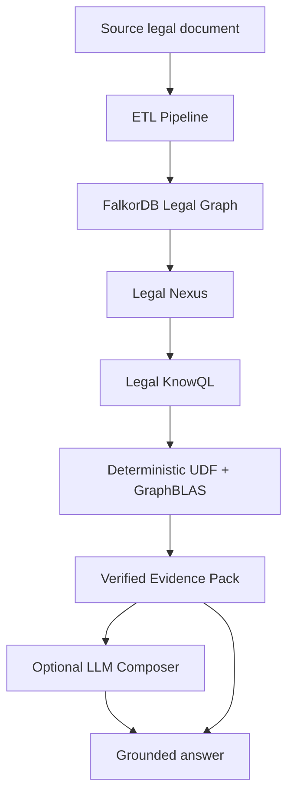
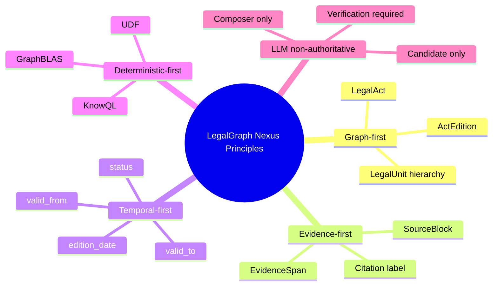
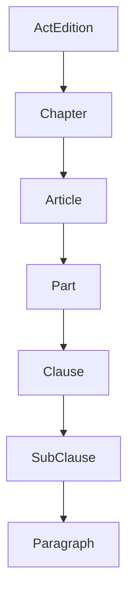
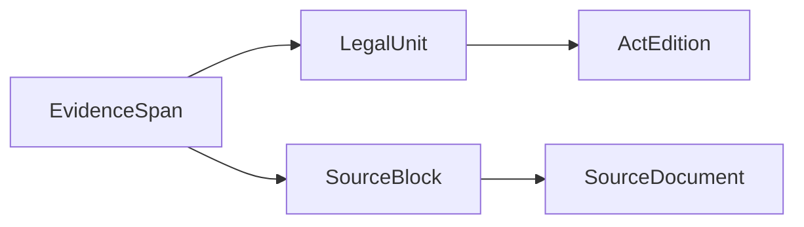
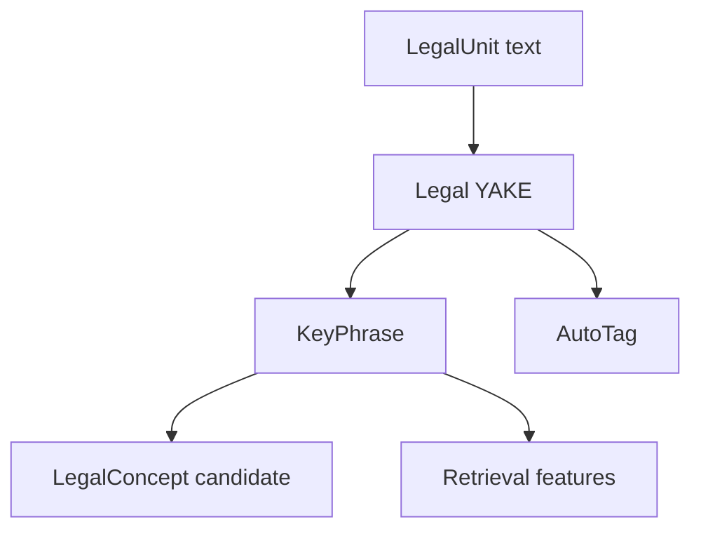
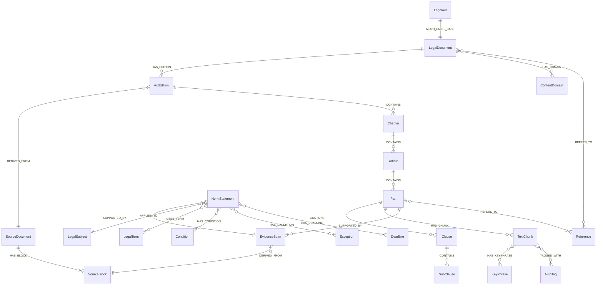
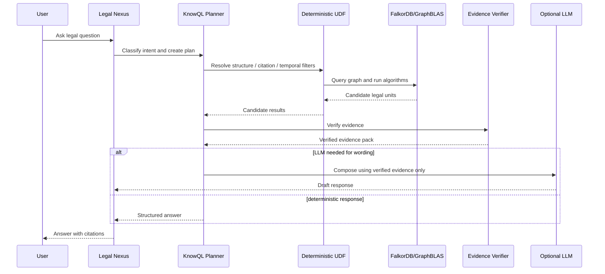
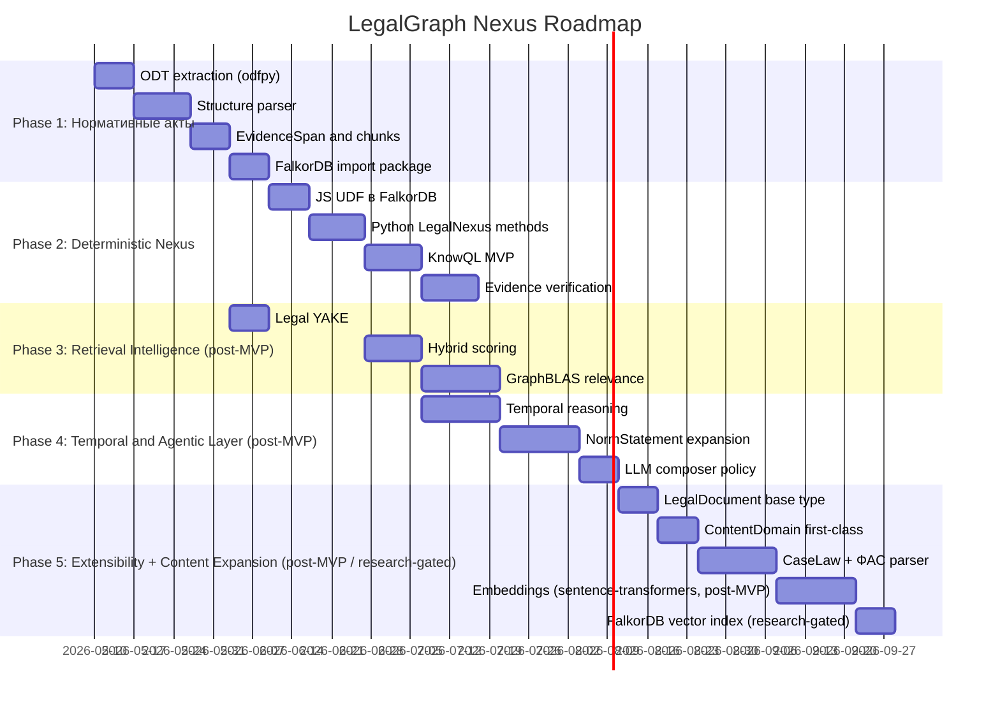

# 3. PRD: LegalGraph FalkorDB Agentic Temporal Knowledge System

## 1. Название продукта

**LegalGraph Nexus** — система подготовки нормативных актов и доступа к ним через FalkorDB-based agentic temporal graph knowledge database с дополнительным слоем **Legal Nexus + Legal KnowQL**.

## 2. Краткое описание

LegalGraph Nexus преобразует нормативные акты из ODT-формата (OpenDocument Text, источник — Гарант) в графово-векторную, темпоральную и evidence-verifiable базу знаний на базе FalkorDB.

Система предназначена для юридически надежного поиска, анализа и ответа на вопросы по нормативным актам с минимальным использованием LLM. Все участки, которые можно проверить алгоритмически, должны выполняться через:

- FalkorDB graph model;
- GraphBLAS algorithms;
- deterministic UDF/procedures;
- Legal KnowQL DSL;
- evidence verification;
- citation-safe retrieval.

LLM является не источником истины, а controlled non-authoritative компонентом.



## 3. Проблема

Классический RAG по юридическим документам имеет существенные ограничения:

- произвольные чанки не совпадают с юридическими нормами;
- LLM может ошибиться в статье, редакции, статусе нормы или ссылке;
- vector search без графовой структуры плохо поддерживает citation и temporal reasoning;
- плоский retrieval плохо масштабируется на корпус нормативных актов;
- отсутствие evidence verification делает ответ юридически ненадежным;
- невозможно аудировать, почему именно эта норма была выбрана.

## 4. Цель продукта

Создать систему, которая обеспечивает:

1. подготовку нормативного акта к импорту в FalkorDB;
2. построение юридического графа структуры, редакций, норм, ссылок и evidence;
3. создание vector-ready и BM25-ready текстовых представлений;
4. поддержку temporal-фильтрации;
5. deterministic-first retrieval и reasoning;
6. формальный query layer, аналогичный идеям Nexus + KnowQL;
7. контролируемое и проверяемое использование LLM.

## 5. Основные принципы

### 5.1. LLM is non-authoritative

LLM не может создавать юридически значимые факты без verification.

### 5.2. Evidence-first

Каждый ответ должен ссылаться на `EvidenceSpan`, связанный с исходным документом.

### 5.3. Citation-aligned indexing

Единица индексации должна соответствовать единице юридического цитирования.

### 5.4. Deterministic-first

Все задачи, которые можно решить алгоритмически, должны решаться без LLM.

### 5.5. Graph-first

Структура закона и связи между нормами являются authoritative knowledge substrate.

### 5.6. Temporal-first

Редакция и период действия нормы должны храниться явно и проверяться алгоритмически.



## 6. Целевые пользователи

### 6.1. Legal Data Engineer

Загружает нормативные акты, контролирует качество парсинга и импортирует пакет в FalkorDB.

### 6.2. AI / RAG Engineer

Строит hybrid retrieval, embeddings, scoring, GraphRAG и агентные сценарии.

### 6.3. Legal Expert

Проверяет юридическую корректность структуры, ссылок, статусов и evidence.

### 6.4. AI Agent

Использует Legal Nexus / KnowQL для получения проверяемых ответов.

## 7. Scope MVP

MVP должен поддерживать обработку 44-ФЗ из ODT-файла Гаранта и создавать FalkorDB import package.

### Входит в MVP

- ODF/ODT XML extraction (`content.xml` via odfpy);
- SourceDocument и SourceBlock;
- LegalAct и ActEdition;
- Chapter, Article, Part, Clause;
- EvidenceSpan;
- TextChunk;
- basic temporal fields;
- basic reference extraction;
- Legal YAKE keyphrases;
- import JSONL + Cypher;
- validation report;
- basic KnowQL query patterns;
- deterministic UDF specification.

### Не входит в MVP

- production embedding generation;
- FalkorDB vector index creation;
- hybrid vector retrieval as a required runtime path;
- полноценное сравнение нескольких редакций;
- гарантия полного semantic parsing всех норм;
- production UI;
- юридическая экспертиза;
- автоматическое обновление из внешних правовых систем;
- LLM-based legal conclusion generation.

### FR-to-phase scope matrix

This matrix resolves F-008 by separating MVP, post-MVP, and candidate-research scope for FR-21 through FR-30b. A requirement listed as post-MVP may be designed during M001, but it is not required for the first 44-ФЗ import MVP unless a later milestone explicitly promotes it.

| FR | Capability | Phase | Scope note |
|---|---|---|---|
| FR-21 | Legal Nexus Module | MVP specification / post-MVP runtime hardening | MVP defines the Python module contract and minimal deterministic lookup paths; production API/service hardening is post-MVP. |
| FR-22 | Legal KnowQL DSL | MVP subset | MVP includes only the minimal query forms needed for structural lookup, status checks, requirements lookup, and reference expansion. |
| FR-23 | Deterministic Query Planner | MVP subset | MVP planner maps supported KnowQL patterns to deterministic graph/evidence operations; broader intent planning is post-MVP. |
| FR-24 | FalkorDB UDF Library | MVP specification / post-MVP runtime expansion | MVP specifies JS UDF vs Python LegalNexus boundaries; larger procedure coverage is post-MVP. |
| FR-25 | GraphBLAS algorithm layer | Post-MVP | Required for target architecture, but not required for the first ODT-to-import MVP unless a proof slice promotes a narrow algorithm. |
| FR-26 | Evidence verification | MVP | MVP must verify citation/evidence existence, edition match, temporal status where known, and no-answer behavior. |
| FR-27 | LLM control policy | MVP | LLM remains non-authoritative from the start; optional composition is allowed only after evidence verification. |
| FR-28 | Extensible document model | Post-MVP with MVP-compatible design | MVP may keep fields compatible with `LegalDocument`/`ContentDomain`, but only 44-ФЗ legal-act ingestion is in scope. |
| FR-28b | Embedding pipeline | Post-MVP, gated by candidate research | `deepvk/USER-bge-m3`, 1024-dimensional embeddings, and FalkorDB vector index are target candidates for Phase 5, not MVP deliverables. |
| FR-29 | No-answer handling | MVP | MVP must return explicit `no_answer` when evidence or verification is missing. |
| FR-30 | Retrieval evaluation dataset | MVP skeleton / post-MVP metrics expansion | MVP creates the dataset skeleton and core citation/evidence metrics; full ranking evaluation is post-MVP. |
| FR-30b | Candidate architecture checks | Candidate research | These checks preserve valuable architecture hypotheses, but they are not implementation scope until validated and promoted. |

## 8. Functional Requirements

## FR-1. Source document ingestion

Система должна принимать ODT-файл нормативного акта и создавать `SourceDocument`.

Обязательные свойства:

```json
{
  "file_name": "...",
  "mime_type": "application/vnd.oasis.opendocument.text",
  "file_size": 5231786,
  "source_system": "Гарант",
  "sha256": "...",
  "imported_at": "..."
}
```

Acceptance criteria:

- вычисляется SHA-256;
- сохраняется имя файла;
- сохраняется source system;
- создается ID источника;
- source metadata входит в import package.

### FR-1a. Idempotent import policy

Import identity is based on `act_number`, `edition_date`, `source_system`, `source_provenance_class`, and `sha256`.

Idempotent policy:

| Case | Required behavior | `imported_at` behavior |
|---|---|---|
| Same `sha256`, same `act_number`, same `edition_date`, same source class | Treat as an idempotent replay. Do not create duplicate `SourceDocument`, `ActEdition`, legal units, EvidenceSpan, TextChunk, or relationship records. | Preserve original `imported_at`; append a separate audit event such as `last_seen_at` / `replayed_at` if runtime audit logging is later implemented. |
| Changed `sha256`, same `act_number`, same `edition_date` | Treat as a new source revision for the same edition. Create a new `SourceDocument` revision and rerun validation before changing current graph pointers. | New source revision gets a new `imported_at`; prior `SourceDocument.imported_at` remains unchanged. |
| New `edition_date` for the same `act_number` | Create a new `ActEdition` and link it to the new `SourceDocument`; do not mutate the prior edition. | New edition/source gets its own `imported_at`. |
| Same `sha256` but different claimed metadata | Block import with a validation error until metadata conflict is resolved. | Do not update `imported_at`. |

A repeated import must be diagnosable from SHA, source provenance class, edition date, and validation/audit records without relying on LLM interpretation.

## FR-2. ODT block extraction

Система должна извлекать текстовые блоки из ODT через odfpy.

Требования:

- извлекать `<text:p>` элементы из content.xml;
- использовать `text:style-name` для определения типа блока;
- сохранять порядок параграфов;
- обрабатывать таблицы;
- создавать `SourceBlock`;
- не терять юридически значимый текст.

## FR-3. Text cleaning

Система должна нормализовать текст без потери юридического смысла.

Нельзя удалять:

- номера статей;
- номера частей и пунктов;
- фразы `утратил силу`;
- temporal-маркеры;
- условия;
- исключения;
- ссылки на другие нормы.

## FR-4. Metadata extraction

Система должна извлекать:

- тип акта;
- номер;
- дату принятия;
- дату редакции;
- полное название;
- краткое название;
- юрисдикцию.

Для целевого файла ожидаемо:

```json
{
  "act_type": "federal_law",
  "number": "44-ФЗ",
  "date": "2013-04-05",
  "edition_date": "2025-12-28",
  "jurisdiction": "RU"
}
```

## FR-5. Legal graph structure parsing

Система должна распознавать иерархию:

```text
Chapter → Article → Part → Clause → SubClause → Paragraph
```

Минимум MVP:

```text
Chapter → Article → Part → Clause
```

Sublegal acts, appendices, footnotes, notes, and tables are explicitly future-owned source-profile work. MVP may process 44-ФЗ using the hierarchy above, but import validation must report preserved-but-unmodeled blocks rather than silently dropping appendices, footnotes, notes, or table material.



## FR-6. Stable IDs and citation keys

Каждая юридическая единица должна иметь стабильный ID и citation key.

Пример:

```json
{
  "id": "ru_fz_44__ed_2025-12-28__art_31__part_1__clause_4",
  "citation_key": "ru-fz-44/2025-12-28/art31/part1/clause4",
  "citation_label": "п. 4 ч. 1 ст. 31 44-ФЗ",
  "path": "44-ФЗ / Статья 31 / Часть 1 / Пункт 4"
}
```

ID grammar and normalization contract:

```ebnf
node_id        = jurisdiction, "_", act_kind, "_", act_number_norm, "__ed_", date, { "__", unit_kind, "_", unit_number_norm } ;
citation_key   = jurisdiction, "-", act_kind, "-", act_number_norm, "/", date, { "/", citation_segment } ;
date           = DIGIT DIGIT DIGIT DIGIT, "-", DIGIT DIGIT, "-", DIGIT DIGIT ;
unit_kind      = "chapter" | "art" | "part" | "clause" | "subclause" | "para" ;
citation_segment = ("ch" | "art" | "part" | "clause" | "subclause" | "para"), unit_number_norm ;
```

Normalization requirements:

- `jurisdiction` uses lowercase ISO-like tokens (`ru` for Russian federal law MVP).
- `act_kind` uses stable lowercase ASCII tokens (`fz`, `code`, `decree`, `letter`, `regional_act`, `unknown_numbered_act`).
- `act_number_norm` lowercases, transliterates Cyrillic legal suffixes only where needed for ASCII IDs, removes `№`, normalizes `N`/`No`, keeps semantic suffixes, and replaces unsafe separators with `-`.
- Dates in IDs and `citation_key` always use ISO `YYYY-MM-DD`; underscores are not used inside dates.
- `node_id` is FalkorDB-safe and filesystem/log-safe; `citation_key` is URL-path-safe and must be percent-encoded only if embedded as a query parameter.
- Acts without a number use a deterministic slug from act type, date, jurisdiction, and a source hash prefix; the full source SHA remains in `SourceDocument`, not in every legal-unit ID.
- Validation tests must include `44-ФЗ`, an act with a letter suffix, an act with `№`/`N`, an unnumbered act, and at least one regional-act placeholder before this grammar is considered implementation-ready.

### FR-6b. Citation formatting policy

MVP `citation_label` is Russian-language, human-readable, and uses compact legal order from narrowest unit to broadest unit: `п. 4 ч. 1 ст. 31 44-ФЗ`. `path` is broadest-to-narrowest navigation text: `44-ФЗ / Статья 31 / Часть 1 / Пункт 4`. Logs, tests, URLs, and deterministic lookup must use `citation_key`, not `citation_label`.

International or non-Russian citation formats are deferred to a later source-family profile. Owner: future ingestion/source-profile milestone. Required tests before promotion: locale-specific label snapshots, round-trip `citation_label → citation_key` where deterministic, and no-answer behavior for unsupported locale profiles.

## FR-7. EvidenceSpan creation

Система должна создавать `EvidenceSpan` для citation-safe grounding.

`EvidenceSpan` должен быть связан с:

- `SourceBlock`;
- `LegalUnit`;
- `ActEdition`;
- `SourceDocument`.



EvidenceSpan lifecycle contract:

- EvidenceSpan identity includes `source_document_id`, `source_sha256`, `source_block_id`, span offsets/selectors, `legal_unit_id`, and `act_edition_id`.
- Same SHA and same span mapping reuses the same EvidenceSpan; repeated import must not duplicate evidence.
- New SHA for the same act/edition creates a new source revision and new EvidenceSpan set after validation; old spans are retained and marked `superseded_by_new_sha` rather than overwritten.
- Parser changes that orphan old spans must be reported as validation warnings/errors with `orphaned_by_parser_change`; they must not silently relink evidence.
- New `edition_date` creates EvidenceSpan records for the new `ActEdition`; old edition evidence remains queryable for historical/audit use.
- `legacy_prior_art` and `generated_summary` source provenance classes cannot create authoritative EvidenceSpan records.

## FR-8. TextChunk creation

Система должна создавать `TextChunk` для vector search, но каждый чанк обязан быть связан с юридической единицей и evidence.

MVP chunking strategy:

- Primary chunks are aligned to legal-unit boundaries (`Article`, `Part`, `Clause`, or smaller parsed units), not arbitrary sliding windows.
- A chunk may carry parent citation/headline context, but must not split conditions, exceptions, deadlines, or temporal markers away from the legal unit they qualify.
- Boundaries must be derived from deterministic ODT/source parsing evidence; unproven LLM boundary suggestions are not accepted.
- Sliding-window overlap is post-MVP only and must remain derived retrieval material linked back to legal-unit EvidenceSpan records.
- Validation must fail orphan chunks and report `orphan_chunk_rate`, `legal_unit_without_chunk_count`, and `chunk_boundary_warning_count`.

Обязательные поля:

```json
{
  "display_text": "...",
  "text_for_embedding": "...",
  "text_for_bm25": "...",
  "normalized_text": "...",
  "citation_text": "...",
  "source_node_id": "...",
  "evidence_span_ids": ["..."]
}
```

## FR-9. Temporal fields

Каждый legal unit, evidence и norm statement должны иметь temporal-поля.

```json
{
  "edition_date": "2025-12-28",
  "valid_from": null,
  "valid_to": null,
  "effective_from": null,
  "effective_to": null,
  "status": "active",
  "temporal_confidence": "unknown"
}
```

Temporal glossary:

- `edition_date` is the source-recorded date of the consolidated edition. It selects an `ActEdition`; it is not a substitute for legal validity dates.
- `valid_from` / `valid_to` describe formal legal force of the unit when the source text or later event extraction supports it.
- `effective_from` / `effective_to` describe practical applicability windows, including delayed application or transitional provisions, when those differ from formal validity.
- `null` means unknown/not extracted, not unbounded truth. Deterministic status checks must return `unknown` or warning-bearing results when required dates are missing.
- `temporal_confidence` records whether dates are extracted directly, inherited from edition context, inferred by deterministic rule, or unknown; LLM output cannot raise temporal confidence.

## FR-10. Temporal marker extraction

Система должна искать маркеры:

```text
утратил силу
утратила силу
вступает в силу
применяется с
действует до
с 1 января 2026 года
до 31 декабря 2025 года
```

## FR-11. Reference extraction

Система должна извлекать внутренние и внешние ссылки.

Внутренние примеры:

```text
статья 31 настоящего Федерального закона
пункт 4 части 1 статьи 93
```

Внешние примеры:

```text
Федеральный закон от 18.07.2011 N 223-ФЗ
Гражданский кодекс Российской Федерации
```

## FR-12. LegalTerm extraction

Система должна извлекать термины и определения, особенно из статей с основными понятиями.

## FR-13. LegalSubject and LegalConcept extraction

Система должна создавать доменные сущности:

```text
заказчик
участник закупки
поставщик
подрядчик
исполнитель
контракт
закупка
единая информационная система
электронная площадка
реестр контрактов
```

## FR-14. NormStatement extraction

Система должна создавать semantic norm layer.

Типы:

```text
definition
requirement
obligation
prohibition
permission
procedure
exception
condition
deadline
competence
liability
reference
scope
```

Modality:

```text
must
must_not
may
is_defined_as
applies_to
does_not_apply_to
unknown
```

NormStatement compatibility and verification contract:

| `type` | Allowed `modality` values | Validator rule |
|---|---|---|
| `definition` | `is_defined_as`, `unknown` | Verified definitions must use `is_defined_as`. |
| `requirement`, `obligation`, `procedure`, `competence` | `must`, `unknown` | Verified operational duties must use `must`. |
| `prohibition`, `liability` | `must_not`, `must`, `unknown` | `liability` may use `must` when source imposes a sanctioning duty; verifier records rationale. |
| `permission` | `may`, `unknown` | Verified permissions must use `may`. |
| `exception`, `condition`, `scope` | `applies_to`, `does_not_apply_to`, `unknown` | Must link to affected statement or LegalUnit. |
| `deadline`, `reference` | `must`, `applies_to`, `unknown` | Chosen by source wording and recorded in verification trace. |

Required fields:

```json
{
  "norm_type": "requirement",
  "modality": "must",
  "extraction_method": "deterministic",
  "verification_status": "verified",
  "source_unit_ids": ["..."],
  "evidence_span_ids": ["..."]
}
```

`extraction_method ∈ {deterministic, llm_candidate, manual}`. `verification_status ∈ {unverified, verified, rejected, needs_manual_review}`. LLM-generated NormStatement records are candidates only; they may support answer generation only after deterministic or manual verification sets `verification_status = verified` and preserves the supporting EvidenceSpan IDs.

## FR-15. Legal YAKE keyphrase extraction

Система должна извлекать ключевые фразы с помощью локального статистического алгоритма Legal YAKE.

Требования:

- русский язык;
- n-граммы 1–7;
- legal stop-list;
- legal glossary bonus;
- boilerplate penalty;
- section weight;
- explainable feature scores.

### FR-15a. Legal YAKE specification

Legal YAKE is an explainable local keyphrase layer, not legal authority. Before implementation it must have a versioned specification:

| Item | Requirement |
|---|---|
| Base algorithm | Declare the YAKE variant and scoring formula, with any legal-domain feature additions documented separately from the base algorithm. |
| Stop-list | Store the Russian legal stop-list in a versioned tracked artifact; each entry records owner, reason, and review date. |
| Glossary | Store legal glossary terms in a versioned tracked artifact with term, normalized form, source/evidence reference when available, and owner. |
| Feature trace | Each KeyPhrase record stores raw YAKE score, legal glossary bonus, boilerplate penalty, section weight, final score, and source legal unit. |
| Quality checks | Measure keyphrase precision/recall or reviewer acceptance on the retrieval evaluation dataset before using KeyPhrase as a ranking signal. |



## FR-16. Structural legal index

Система должна создавать индексы:

```text
(act_number, edition_date) → ActEdition
(act_number, edition_date, article_number) → Article
(act_number, edition_date, article_number, part_number) → Part
(act_number, edition_date, article_number, part_number, clause_number) → Clause
term_normalized → LegalTerm
citation_key → LegalUnit
```

## FR-17. Multi-representation text fields

Для retrieval должны храниться разные текстовые представления:

- `display_text`;
- `text_for_embedding`;
- `text_for_bm25`;
- `normalized_text`;
- `citation_text`.

## FR-18. Priority legal units

Система должна помечать priority units:

```text
direct_article_reference
definition
temporal_marker
exception
term_definition
explicit_cross_reference
```

## FR-19. Import package generation

Система должна генерировать пакет:

```text
01_source_document.json
02_legal_act.json
03_source_blocks.jsonl
04_structure_nodes.jsonl
05_evidence_nodes.jsonl
06_norm_nodes.jsonl
07_entity_nodes.jsonl
08_term_nodes.jsonl
09_chunk_nodes.jsonl
10_keyphrase_nodes.jsonl
11_relationships.jsonl
12_embeddings.jsonl
13_import.cypher
14_validation_report.json
15_quality_report.json
16_retrieval_eval.json
17_cleaned.md
```

Each JSON/JSONL artifact must have a versioned JSON Schema before production import treats the format as stable. MVP schemas are required for source documents, legal-act metadata, source blocks, structure nodes, evidence nodes, chunks, keyphrases, relationships, validation reports, quality reports, and retrieval-eval skeletons. `12_embeddings.jsonl` is a required post-MVP schema backlog item linked to FR-28b: it must specify `chunk_id`, `embedding_model_id`, `embedding_dimension`, vector/checksum or `external_vector_id`, source SHA, and schema version before embeddings are promoted.

## FR-20. Import package validation

Перед импортом система должна проверять:

- unique node IDs;
- relationship endpoints exist;
- required properties;
- valid paths;
- citation labels;
- temporal fields;
- no empty text chunks;
- no orphan legal units;
- no orphan evidence spans;
- valid Cypher.

### FR-20a. Validation report schema

Validation output is `14_validation_report.json` and must conform to a versioned JSON Schema. Severity levels are `ERROR`, `WARNING`, and `INFO`; any `ERROR` blocks import and sets non-zero validation exit code. `WARNING` is non-blocking only when explicitly acknowledged by the importer policy. `INFO` is diagnostic.

Minimum schema shape:

```json
{
  "schema_version": "validation-report.v1",
  "package_id": "44fz-2025-12-28",
  "generated_at": "2026-05-09T00:00:00Z",
  "status": "passed | failed | passed_with_warnings",
  "exit_code": 0,
  "summary": { "errors": 0, "warnings": 0, "info": 0 },
  "checks": [
    {
      "check_id": "relationship_endpoints_exist",
      "severity": "ERROR",
      "status": "passed | failed | skipped",
      "artifact": "11_relationships.jsonl",
      "record_id": "...",
      "message": "human-readable diagnostic",
      "evidence": {}
    }
  ]
}
```

`valid Cypher` means static checks over generated labels, relationship names, parameters, endpoint references, and allowed statement classes. Runtime execution against FalkorDB is a separate smoke/proof check and must not be claimed from static validation alone.

## FR-21. Legal Nexus Module

Система должна предоставлять Python-модуль (`LegalNexus` класс) поверх FalkorDB для:

- structural lookup;
- temporal lookup;
- citation resolution;
- evidence retrieval;
- reference expansion;
- deterministic ranking;
- graph traversal;
- hybrid retrieval;
- verified answer context generation.

Python-методы LegalNexus:

```python
class LegalNexus:
    def structural_lookup(self, act, article, part, clause):
        # детерминированный lookup структуры

    def temporal_lookup(self, node_id, date):
        # проверка temporal status

    def citation_resolution(self, citation, edition_date):
        # resolve "п. 4 ч. 1 ст. 31 44-ФЗ"

    def find_requirements(self, subject, act, date):
        # поиск требований

    def verify_evidence(self, claim, evidence_ids):
        # верификация evidence

    def build_context(self, query, candidates):
        # построение context для LLM
```

## FR-22. Legal KnowQL DSL

Система должна поддерживать DSL для юридических запросов.

Canonical MVP syntax uses command + object, `WHERE key = value` predicates, optional `IN act = value`, optional `AT "YYYY-MM-DD"`, and explicit `RETURN` fields. The parser must reject legacy illustrative forms such as `FOR subject "..."` and `AT date "..."` with structured diagnostics.

EBNF sketch:

```ebnf
query          = get_query | find_query | check_query | expand_query ;
get_query      = "GET" object where_clause [ at_clause ] [ return_clause ] ;
find_query     = "FIND" object where_clause [ in_clause ] [ at_clause ] [ return_clause ] ;
check_query    = "CHECK" status_object "OF" string [ at_clause ] [ return_clause ] ;
expand_query   = "EXPAND" "references" "FROM" string [ depth_clause ] [ at_clause ] [ return_clause ] ;
where_clause   = "WHERE" predicate { "AND" predicate } ;
predicate      = identifier "=" value ;
in_clause      = "IN" "act" "=" value ;
at_clause      = "AT" date_string ;
return_clause  = "RETURN" identifier { "," identifier } ;
depth_clause   = "DEPTH" integer ;
value          = string | identifier | integer ;
date_string    = string ;  (* YYYY-MM-DD validated semantically *)
```

KnowQL error contract:

```json
{
  "error_code": "syntax_error | unknown_identifier | unknown_legal_unit | ambiguous_reference | unsupported_pattern | execution_error",
  "message": "human-readable diagnostic",
  "span": { "start": 0, "end": 10 },
  "hint": "expected WHERE predicate: key = value",
  "candidate_citations": []
}
```

Минимальные команды MVP:

```sql
GET norm WHERE act = "44-ФЗ" AND article = "31" RETURN text, citation, evidence
GET article WHERE act = "44-ФЗ" AND article = "31" RETURN text, citation, evidence
CHECK status OF "ч. 1 ст. 31 44-ФЗ" AT "2025-12-28" RETURN status, temporal_evidence
FIND requirements WHERE subject = "участник закупки" IN act = "44-ФЗ" AT "2025-12-28" RETURN norm, citation, evidence
EXPAND references FROM "ст. 93 44-ФЗ" DEPTH 2 RETURN citation, evidence
```

## FR-23. Deterministic Query Planner

Planner должен преобразовывать запрос в план выполнения.

Пример:

```json
{
  "intent": "find_requirements",
  "requires_llm": false,
  "strategy": "deterministic_graph_lookup",
  "js_udf_calls": ["legal.active_at"],
  "python_legalnexus_methods": ["legal.find_requirements", "legal.verify_evidence"],
  "verification_required": true
}
```

## FR-24. FalkorDB UDF Library

`legal.*` is the public operation namespace. MVP splits it into bounded JavaScript UDFs in FalkorDB and orchestration methods in Python LegalNexus.

| Operation | Layer | Implementation | Return contract |
|---|---|---|---|
| `legal.active_at(node_id, date)` | JavaScript UDF | FalkorDB JS UDF | `TemporalStatus { status, reason, evidence_ids[] }` |
| `legal.format_citation(node_id)` | JavaScript UDF | FalkorDB JS UDF | `Citation { citation_label, citation_key, path }` |
| `legal.get_norm_id(act, article, part?, clause?, date?)` | JavaScript UDF | FalkorDB JS UDF | `NormRef { node_id, citation_key, status }` or `null` |
| `legal.resolve_citation(citation, edition_date?)` | Python LegalNexus | `LegalNexus.resolve_citation` | `CitationResolution { candidates[], selected?, ambiguity }` |
| `legal.find_requirements(subject, act?, date?)` | Python LegalNexus | `LegalNexus.find_requirements` | `EvidencePack { norm_statements[], citations[], verification }` |
| `legal.verify_evidence(claim, evidence_ids)` | Python LegalNexus | `LegalNexus.verify_evidence` | `VerificationResult { status, checked_at, failures[], evidence_ids[] }` |
| `legal.build_context(query, candidates, max_scope)` | Python LegalNexus | `LegalNexus.build_context` | `AnswerContext { evidence_pack, citations, llm_allowed }` |
| `legal.expand_references(node_id, depth, date?)` | Python LegalNexus | `LegalNexus.expand_references` | `ReferenceExpansion { nodes[], edges[], evidence_spans[] }` |
| `legal.rank_candidates(query, candidates, date?)` | Python LegalNexus | `LegalNexus.rank_candidates` | `RankedCandidates { candidates[], scoring_trace }` |

JS UDF constraints: no async I/O, no external calls, no unbounded traversal or large aggregation, no evidence-pack assembly, no ranking, and no LLM context construction. Breaking return-contract changes require an explicit API version bump (`api_version = v2`) and migration note; UDF v1 names remain backward-compatible or get a v2 operation name.

## FR-25. GraphBLAS algorithm layer

Система должна использовать GraphBLAS для:

- graph expansion;
- relevance propagation;
- reference closure;
- temporal subgraph filtering;
- graph-distance scoring;
- concept-neighborhood search;
- orphan detection.

GraphBLAS integration is post-MVP until validated. The implementation backlog must choose a concrete binding, define FalkorDB-to-matrix export scope, cache keys, invalidation rules after import/migration/backfill, and observability metrics for export duration, cache hit/miss, compute duration, node/edge counts, and stale-cache rejections.

## FR-26. Evidence verification

Система должна проверять, что ответ или утверждение поддержаны конкретным evidence.

Проверки:

```text
citation_path_exists
evidence_exists
edition_matches
temporal_status_valid
claim_supported_by_source_text
reference_resolved
```

## FR-27. LLM control policy

Система должна иметь policy:

```json
{
  "structural_lookup": "llm_forbidden",
  "temporal_validity": "llm_forbidden",
  "citation_resolution": "llm_forbidden",
  "evidence_verification": "llm_forbidden",
  "semantic_explanation": "llm_allowed_after_verification",
  "ambiguous_query_rewrite": "llm_allowed_with_trace",
  "norm_statement_extraction": "llm_allowed_if_verified"
}
```

## FR-28. Extensible document model

Система должна поддерживать гетерогенные источники:

- `LegalDocument` как базовый multi-label тип, который ставится на каждый документный node вместе с конкретным типом (`LegalAct`, позже `CaseLaw`, `PracticeDocument`);
- `document_type` обязателен и принимает значения `legal_act`, `case_law`, `practice_document`;
- `ContentDomain` как первоклассный node;
- каждый `LegalDocument` обязан иметь минимум один `HAS_DOMAIN` к `ContentDomain`, default для MVP — `normative_acts`;
- ETL-пайплайн параметризован: `document_type` задаётся при загрузке.

## FR-28b. Embedding pipeline

**Phase:** post-MVP, gated by candidate research.

The target architecture may generate embeddings after MVP scope is proven, but this is not a first import-MVP requirement.

Post-MVP candidate requirements:

- Model: `sentence-transformers` + `deepvk/USER-bge-m3`;
- Dimension: 1024;
- Vector store: FalkorDB vector index (cosine similarity), subject to runtime and scale validation;
- Каждый TextChunk связан с embedding when embeddings are enabled.

Promotion criteria before implementation scope:

- local/offline embedding runtime is verified for Russian legal text;
- FalkorDB vector index behavior is verified for 1024-dimensional vectors at representative scale;
- `12_embeddings.jsonl` schema and TextChunk linkage are specified;
- fallback strategy is defined if FalkorDB vector indexing is insufficient.

## FR-28c. Vector store fallback

FalkorDB remains the authoritative legal graph even if vector search is externalized. If FalkorDB vector indexing fails representative scale, latency, memory, or operational tests, embeddings may be stored in Qdrant, pgvector, or another approved vector store using `external_vector_id` while FalkorDB stores the `TextChunk`, citation, temporal, and EvidenceSpan graph.

Fallback requirements:

- retrieval results must join back to `TextChunk -> EvidenceSpan -> SourceBlock -> ActEdition` before scoring or answer generation;
- vector records include `chunk_id`, `embedding_model_id`, `embedding_dimension`, `source_sha256`, and schema version;
- the fallback path must preserve `no_answer` behavior when graph/evidence verification fails;
- operational metrics must compare FalkorDB vector index and fallback latency/recall before promotion.

## FR-29. No-answer handling

Если evidence не найдено или verification failed, система должна возвращать `no_answer`.

```json
{
  "answer": null,
  "reason": "no_supporting_evidence",
  "searched_scope": "44-ФЗ редакция 2025-12-28"
}
```

## FR-30. Retrieval evaluation dataset

Система должна поддерживать тестовый набор вопросов для оценки retrieval и grounding.

Метрики:

```text
Recall@k
Precision@k
MRR
nDCG
citation_precision
citation_recall
evidence_coverage
unresolved_reference_rate
orphan_chunk_rate
temporal_filter_accuracy
```

## FR-30b. Candidate architecture checks requiring research

Следующие идеи считаются ценными кандидатами для LegalGraph Nexus, но до дополнительного исследования и проверки не являются подтвержденными MVP-требованиями:

| Candidate | Expected value | Required research / verification |
|---|---|---|
| Версии закона как aggregation, а не полные document snapshots | Снизить дублирование редакций и сохранить историю изменений на уровне legal units. | Проверить модель стабильных ID, idempotent import, query complexity и совместимость с `ActEdition`. |
| Action nodes для поправок, отмен, публикации, вступления в силу и прекращения действия | Сделать temporal reasoning объяснимым и доказуемым через события изменения права. | Проверить, можно ли извлекать события из доступных источников и связывать их с EvidenceSpan/SourceBlock. |
| Document-level + temporal pre-filter до vector/BM25 поиска | Предотвратить смешение одноименных актов, разных лет, редакций и нерелевантных частей документа. | Проверить routing accuracy на тестовом наборе запросов и определить fallback для неоднозначных запросов. |
| Clause/legal-unit chunking вместо sliding windows | Сохранить юридический смысл, условия, исключения, даты и citation labels внутри evidence-safe chunks. | S05 должен проверить реальные границы legal units в `44-fz.odt`; затем нужно измерить orphan/overlap/error rates. |
| Evidence Auditor после LLM | Не принимать LLM-формулировку, если ее claims не проходят проверку against EvidenceSpan, SourceBlock, ActEdition and temporal status. | Спроектировать claim-to-evidence checks и негативные тесты на hallucinated citations. |
| Fast-paths для citation/date/amount/deadline запросов | Уменьшить latency/cost и повысить детерминированность для структурных юридических вопросов. | Оценить покрытие запросов, no-answer behavior и точность deterministic UDF/KnowQL lookup. |
| Source provenance classes для official/open/commercial/legacy источников | Не смешивать официальные публикации, открытые реконструированные корпуса, коммерческие консолидированные редакции, legacy prior art и generated summaries. | S07/S08 должны классифицировать PRD/source strategy; future ingestion должен хранить source class and confidence. |

## FR-31. Quality report

Система должна генерировать отчет:

```json
{
  "act": "44-ФЗ",
  "edition_date": "2025-12-28",
  "chapters_found": 0,
  "articles_found": 0,
  "parts_found": 0,
  "clauses_found": 0,
  "evidence_spans_created": 0,
  "chunks_created": 0,
  "keyphrases_created": 0,
  "references_found": 0,
  "unresolved_references": 0,
  "temporal_markers_found": 0,
  "warnings": []
}
```

## 9. Non-functional Requirements

## NFR-1. Determinism

Алгоритмические операции должны быть воспроизводимыми.

## NFR-2. Auditability

Каждый результат должен иметь trace:

```text
query → plan → graph operations → evidence → verification → answer
```

## NFR-3. Scalability

Система должна масштабироваться от одного закона до корпуса нормативных актов.

## NFR-4. Idempotency

Повторный импорт одного файла не должен создавать дубликаты. The concrete Idempotent import policy is defined in FR-1a: same SHA is a replay/no-op for graph facts, changed SHA for the same edition is a new source revision, and new `edition_date` is a new `ActEdition`. `imported_at` is immutable for the original source record; repeated import attempts must be tracked separately from source creation time.

## NFR-5. Privacy / Local-first compatibility

Система должна позволять выполнение без отправки документов во внешние LLM.

## NFR-6. Legal precision

Нельзя терять юридически значимые фрагменты.

## NFR-7. Performance target MVP

Без embeddings:

```text
ODT extraction: до 30 секунд
structure parsing: до 30 секунд
chunk generation: до 30 секунд
validation: до 30 секунд
```

## NFR-8. Explainability

Retrieval score должен быть decomposable.

Evidence is a hard filter before scoring. Candidates without verified EvidenceSpan/SourceBlock/ActEdition support are rejected and cannot be rescued by a high BM25/vector/graph score. `evidence_confidence` is a small bonus/penalty among already evidence-backed candidates, not a substitute for evidence.

Пример:

```json
{
  "final_score": 0.91,
  "components": {
    "structural_match": 1.0,
    "graph_relevance": 0.86,
    "bm25": 0.74,
    "vector": 0.79,
    "yake_keyphrase": 0.88,
    "temporal_validity": 1.0,
    "evidence_confidence": 1.0
  }
}
```

## NFR-9. Extensibility

Граф-модель и ETL-пайплайн должны поддерживать добавление новых типов документов без переработки ядра:

- `LegalDocument` base type + подтипы;
- `ContentDomain` first-class concept;
- параметризованный ETL с `document_type`;
- JS UDF в FalkorDB для простых операций;
- Python LegalNexus для сложной оркестрации.

## NFR-10. Security and access control

Before any non-local deployment, the system must define access control for FalkorDB credentials, import package generation, KnowQL/API endpoints, audit logs, and source-document artifacts. Authorization must distinguish import operators, query users, legal reviewers, and administrators. Logs and metrics must not expose raw legal text, secrets, credentials, or unmanaged source files to unauthorized users.

## NFR-11. Observability metrics

ETL, validation, Legal Nexus, KnowQL, retrieval, evidence verification, GraphBLAS, and vector-store components must emit agent-usable metrics and structured diagnostics. Required metric families include latency (`p50`, `p95`, `p99`), throughput, error counts, validation failure counts, `no_answer` counts, orphan chunk/evidence counts, evidence verification failures, query plan operation names, cache hit/miss rates, and migration/backfill progress. Metrics must be keyed by operation/schema/version identifiers rather than raw legal text.

## NFR-12. Migration and backfill

Schema evolution must be versioned and reversible. Adding required fields, labels, relationships, validation checks, vector metadata, or GraphBLAS cache inputs requires a migration/backfill plan with dry-run report, idempotency key, rollback/restore point, affected-count summary, and post-backfill validation report. Backfills over large legal-unit corpora must support batching and resume from checkpoints.

## 10. Target data model

`LegalDocument` is the base label for graph document nodes. The MVP 44-ФЗ node is multi-labeled `LegalDocument` + `LegalAct`, not connected through a separate inheritance relationship. `document_type` is required and equals `legal_act` for MVP; later `case_law` and `practice_document` values reuse the same base label. `ContentDomain` is a first-class node; every `LegalDocument` must have at least one `HAS_DOMAIN` relationship, defaulting to `normative_acts` for MVP.

`Reference`, `KeyPhrase`, and `AutoTag` remain explicit graph nodes in the target model. A `Reference` records the citation expression found in a legal unit and may point to a resolved target legal unit or legal document; unresolved references remain as `Reference` nodes with validation warnings.



## 11. Query flow requirements



## 12. Acceptance criteria for MVP

MVP считается успешным, если:

1. ODT 44-ФЗ из Гаранта обрабатывается без потери основного текста.
2. Создаются `LegalAct` и `ActEdition`.
3. Распознаются главы, статьи, части и пункты.
4. Создаются `EvidenceSpan` и `TextChunk`.
5. Каждый `TextChunk` связан с legal unit и evidence.
6. Каждая legal unit имеет `path` и `citation_label`.
7. Есть temporal-поля и basic status detection.
8. Есть Legal YAKE keyphrases.
9. Генерируется FalkorDB import package.
10. Генерируется validation report.
11. Генерируется Cypher import script.
12. Есть спецификация UDF.
13. Есть минимальный KnowQL subset.
14. Есть retrieval evaluation dataset skeleton.
15. LLM не используется для structural lookup, citation resolution и evidence verification.

## 13. Roadmap

The roadmap below remains directional. MVP scope is defined by §7 and the FR-to-phase matrix; post-MVP roadmap items must not be treated as immediate implementation requirements. Embeddings, FalkorDB vector index work, broader hybrid retrieval, GraphBLAS relevance, extensible document types, and content expansion are post-MVP unless a later validation milestone explicitly promotes a narrower slice.

The following candidate checks must be researched before they are promoted into implementation scope:

- Temporal model check: compare full `ActEdition` snapshots with aggregation-based editions that reuse unchanged legal units.
- Legal event graph check: evaluate `Action` nodes for amendments, repeal, publication, entry into force, expiration, and correction.
- Retrieval routing check: validate document-level and temporal pre-filters before BM25/vector search.
- Chunking check: verify clause/legal-unit chunking against the real ODT source and reject sliding-window chunking where it breaks legal meaning.
- Evidence Auditor check: design post-LLM claim verification against EvidenceSpan, SourceBlock, ActEdition, temporal status, and citation labels.
- Fast-path check: estimate deterministic coverage for citation/date/amount/deadline queries before invoking LLM composition.
- Source provenance check: classify official/open/commercial/legacy/generated sources and define confidence rules for each class.



## 14. Risks and mitigations

| Risk | Impact | Mitigation |
|---|---:|---|
| ODT structure from Garant is noisy / style-based hierarchy | High | SourceBlock preservation and validation, style-name analysis |
| Legal structure parsing errors | High | parse confidence and quality report |
| Temporal ambiguity | High | `temporal_confidence`, no unsupported inference |
| LLM hallucination | High | LLM non-authoritative policy |
| Flat retrieval degradation | High | hierarchical routing and graph filtering |
| Duplicate IDs | Medium | import package validation |
| Over-citation noise | Medium | citation scope control |
| Incomplete reference resolution | Medium | unresolved reference nodes and warnings |
| Extensibility — adding new document types | Medium | LegalDocument base type, ContentDomain, parameterized ETL |
| ODT parsing edge cases (tables, nested structures) | Medium | odfpy robust handling, fallback to raw text |

## 15. Success metrics

### ETL metrics

```text
articles_detected
parts_detected
clauses_detected
evidence_spans_created
chunks_created
orphan_units_count
empty_chunks_count
```

### Graph metrics

```text
nodes_created
relationships_created
duplicate_ids
unresolved_relationships
orphan_chunks
orphan_evidence
```

### Retrieval metrics

```text
Recall@k
Precision@k
MRR
citation_precision
citation_recall
evidence_coverage
```

### Deterministic reasoning metrics

```text
citation_resolution_accuracy
temporal_filter_accuracy
definition_lookup_accuracy
status_lookup_accuracy
no_answer_accuracy
```

## 16. Final product statement

LegalGraph Nexus должен стать не просто ETL-пайплайном и не обычным RAG, а **юридическим knowledge operating layer**:

```text
FalkorDB graph = источник истины
GraphBLAS = вычислимое reasoning ядро
UDF = проверяемая юридическая логика
KnowQL = формальный язык запросов
EvidenceSpan = доказательство
Legal YAKE = explainable semantic enrichment
LLM = контролируемый языковой интерфейс
```

Главное требование: **любой юридически значимый ответ должен быть получен или проверен алгоритмически и подтвержден evidence из конкретной нормы конкретной редакции нормативного акта.**
