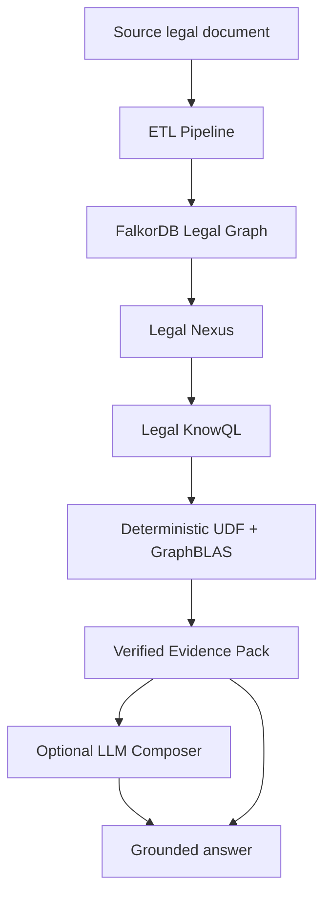
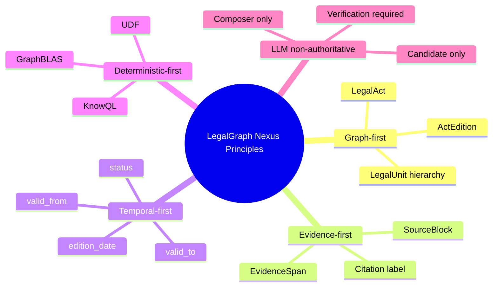
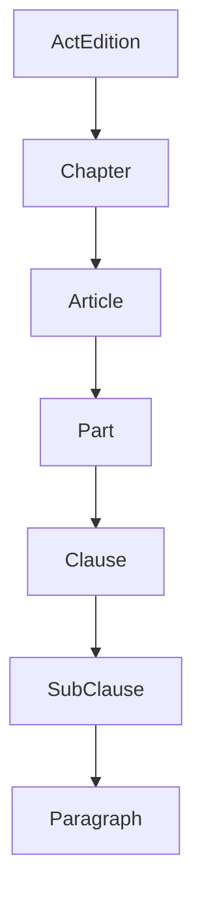
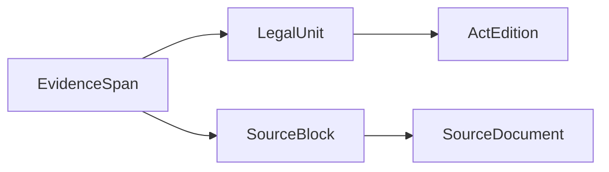
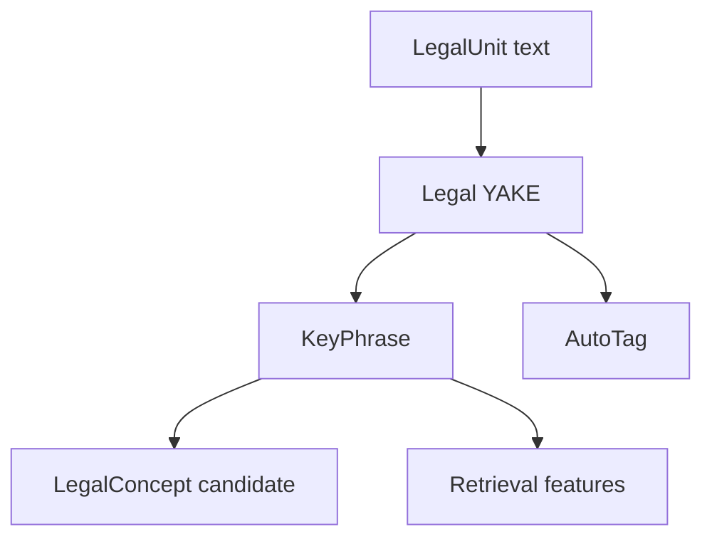
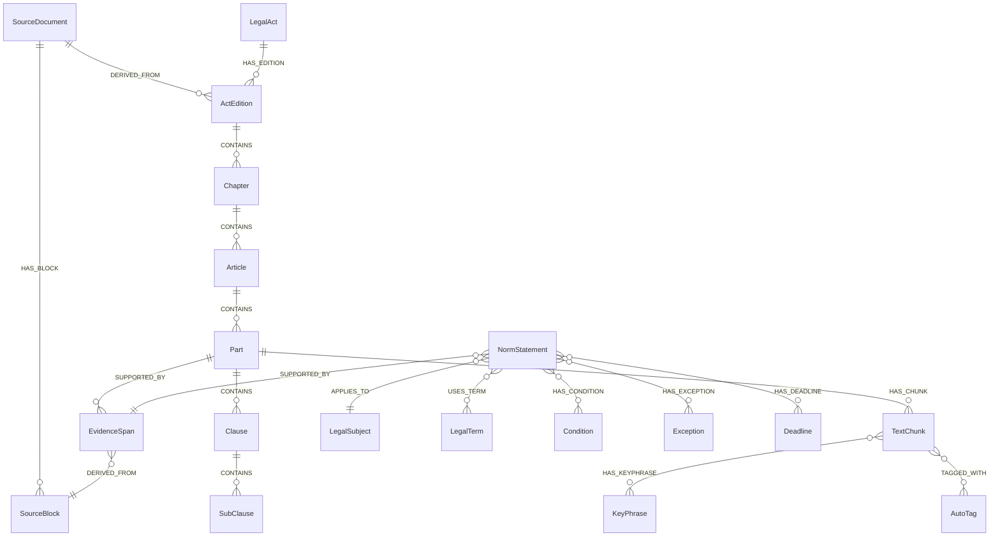
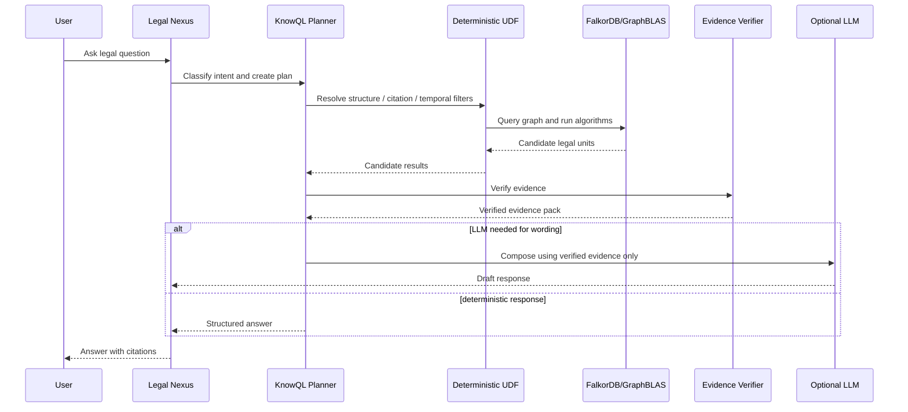
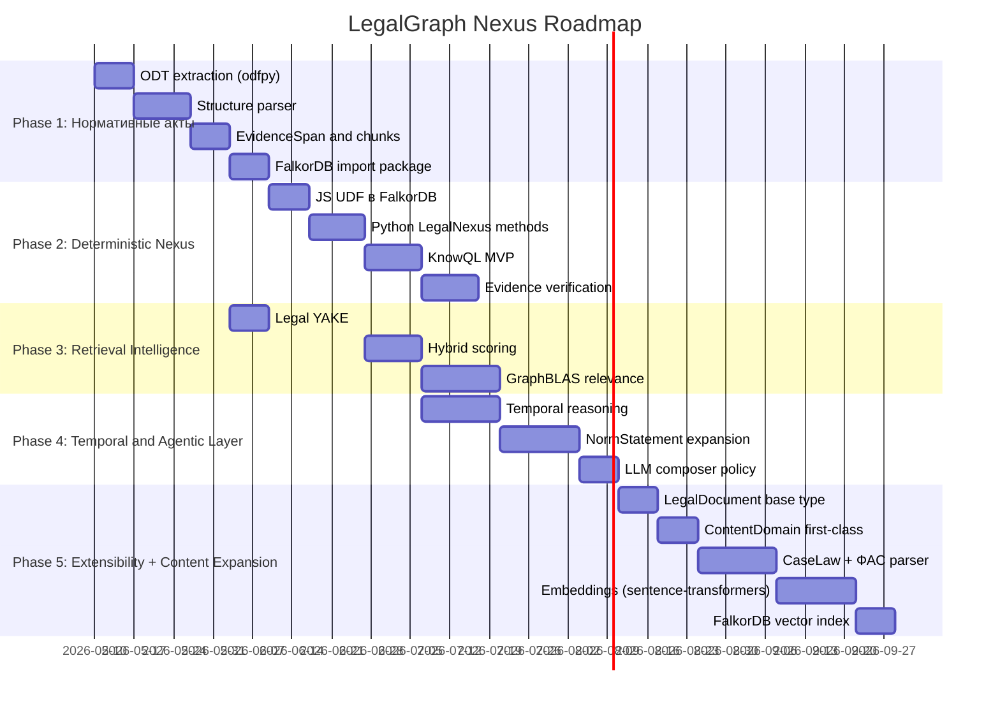

# 3. PRD: LegalGraph FalkorDB Agentic Temporal Knowledge System

## 1. Название продукта

**LegalGraph Nexus** — система подготовки нормативных актов и доступа к ним через FalkorDB-based agentic temporal graph knowledge database с дополнительным слоем **Legal Nexus + Legal KnowQL**.

## 2. Краткое описание

LegalGraph Nexus преобразует нормативные акты из ODT-формата (OpenDocument Text, источник — Гарант) в графово-векторную, темпоральную и evidence-verifiable базу знаний на базе FalkorDB.

Система предназначена для юридически надежного поиска, анализа и ответа на вопросы по нормативным актам с минимальным использованием LLM. Все участки, которые можно проверить алгоритмически, должны выполняться через:

- FalkorDB graph model;
- GraphBLAS algorithms;
- deterministic UDF/procedures;
- Legal KnowQL DSL;
- evidence verification;
- citation-safe retrieval.

LLM является не источником истины, а controlled non-authoritative компонентом.



## 3. Проблема

Классический RAG по юридическим документам имеет существенные ограничения:

- произвольные чанки не совпадают с юридическими нормами;
- LLM может ошибиться в статье, редакции, статусе нормы или ссылке;
- vector search без графовой структуры плохо поддерживает citation и temporal reasoning;
- плоский retrieval плохо масштабируется на корпус нормативных актов;
- отсутствие evidence verification делает ответ юридически ненадежным;
- невозможно аудировать, почему именно эта норма была выбрана.

## 4. Цель продукта

Создать систему, которая обеспечивает:

1. подготовку нормативного акта к импорту в FalkorDB;
2. построение юридического графа структуры, редакций, норм, ссылок и evidence;
3. создание vector-ready и BM25-ready текстовых представлений;
4. поддержку temporal-фильтрации;
5. deterministic-first retrieval и reasoning;
6. формальный query layer, аналогичный идеям Nexus + KnowQL;
7. контролируемое и проверяемое использование LLM.

## 5. Основные принципы

### 5.1. LLM is non-authoritative

LLM не может создавать юридически значимые факты без verification.

### 5.2. Evidence-first

Каждый ответ должен ссылаться на `EvidenceSpan`, связанный с исходным документом.

### 5.3. Citation-aligned indexing

Единица индексации должна соответствовать единице юридического цитирования.

### 5.4. Deterministic-first

Все задачи, которые можно решить алгоритмически, должны решаться без LLM.

### 5.5. Graph-first

Структура закона и связи между нормами являются authoritative knowledge substrate.

### 5.6. Temporal-first

Редакция и период действия нормы должны храниться явно и проверяться алгоритмически.



## 6. Целевые пользователи

### 6.1. Legal Data Engineer

Загружает нормативные акты, контролирует качество парсинга и импортирует пакет в FalkorDB.

### 6.2. AI / RAG Engineer

Строит hybrid retrieval, embeddings, scoring, GraphRAG и агентные сценарии.

### 6.3. Legal Expert

Проверяет юридическую корректность структуры, ссылок, статусов и evidence.

### 6.4. AI Agent

Использует Legal Nexus / KnowQL для получения проверяемых ответов.

## 7. Scope MVP

MVP должен поддерживать обработку 44-ФЗ из ODT-файла Гаранта и создавать FalkorDB import package.

### Входит в MVP

- WordML XML extraction;
- SourceDocument и SourceBlock;
- LegalAct и ActEdition;
- Chapter, Article, Part, Clause;
- EvidenceSpan;
- TextChunk;
- basic temporal fields;
- basic reference extraction;
- Legal YAKE keyphrases;
- import JSONL + Cypher;
- validation report;
- basic KnowQL query patterns;
- deterministic UDF specification.

### Не входит в MVP

- полноценное сравнение нескольких редакций;
- гарантия полного semantic parsing всех норм;
- production UI;
- юридическая экспертиза;
- автоматическое обновление из внешних правовых систем;
- LLM-based legal conclusion generation.

## 8. Functional Requirements

## FR-1. Source document ingestion

Система должна принимать ODT-файл нормативного акта и создавать `SourceDocument`.

Обязательные свойства:

```json
{
  "file_name": "...",
  "mime_type": "application/vnd.oasis.opendocument.text",
  "file_size": 5231786,
  "source_system": "Гарант",
  "sha256": "...",
  "imported_at": "..."
}
```

Acceptance criteria:

- вычисляется SHA-256;
- сохраняется имя файла;
- сохраняется source system;
- создается ID источника;
- source metadata входит в import package.

## FR-2. ODT block extraction

Система должна извлекать текстовые блоки из ODT через odfpy.

Требования:

- извлекать `<text:p>` элементы из content.xml;
- использовать `text:style-name` для определения типа блока;
- сохранять порядок параграфов;
- обрабатывать таблицы;
- создавать `SourceBlock`;
- не терять юридически значимый текст.

## FR-3. Text cleaning

Система должна нормализовать текст без потери юридического смысла.

Нельзя удалять:

- номера статей;
- номера частей и пунктов;
- фразы `утратил силу`;
- temporal-маркеры;
- условия;
- исключения;
- ссылки на другие нормы.

## FR-4. Metadata extraction

Система должна извлекать:

- тип акта;
- номер;
- дату принятия;
- дату редакции;
- полное название;
- краткое название;
- юрисдикцию.

Для целевого файла ожидаемо:

```json
{
  "act_type": "federal_law",
  "number": "44-ФЗ",
  "date": "2013-04-05",
  "edition_date": "2025-12-28",
  "jurisdiction": "RU"
}
```

## FR-5. Legal graph structure parsing

Система должна распознавать иерархию:

```text
Chapter → Article → Part → Clause → SubClause → Paragraph
```

Минимум MVP:

```text
Chapter → Article → Part → Clause
```



## FR-6. Stable IDs and citation keys

Каждая юридическая единица должна иметь стабильный ID и citation key.

Пример:

```json
{
  "id": "ru_fz_44_edition_2025_12_28_article_31_part_1_clause_4",
  "citation_key": "44fz:2025-12-28:art31:part1:clause4",
  "citation_label": "п. 4 ч. 1 ст. 31 44-ФЗ",
  "path": "44-ФЗ / Статья 31 / Часть 1 / Пункт 4"
}
```

## FR-7. EvidenceSpan creation

Система должна создавать `EvidenceSpan` для citation-safe grounding.

`EvidenceSpan` должен быть связан с:

- `SourceBlock`;
- `LegalUnit`;
- `ActEdition`;
- `SourceDocument`.



## FR-8. TextChunk creation

Система должна создавать `TextChunk` для vector search, но каждый чанк обязан быть связан с юридической единицей и evidence.

Обязательные поля:

```json
{
  "display_text": "...",
  "text_for_embedding": "...",
  "text_for_bm25": "...",
  "normalized_text": "...",
  "citation_text": "...",
  "source_node_id": "...",
  "evidence_span_ids": ["..."]
}
```

## FR-9. Temporal fields

Каждый legal unit, evidence и norm statement должны иметь temporal-поля.

```json
{
  "edition_date": "2025-12-28",
  "valid_from": null,
  "valid_to": null,
  "effective_from": null,
  "effective_to": null,
  "status": "active",
  "temporal_confidence": "unknown"
}
```

## FR-10. Temporal marker extraction

Система должна искать маркеры:

```text
утратил силу
утратила силу
вступает в силу
применяется с
действует до
с 1 января 2026 года
до 31 декабря 2025 года
```

## FR-11. Reference extraction

Система должна извлекать внутренние и внешние ссылки.

Внутренние примеры:

```text
статья 31 настоящего Федерального закона
пункт 4 части 1 статьи 93
```

Внешние примеры:

```text
Федеральный закон от 18.07.2011 N 223-ФЗ
Гражданский кодекс Российской Федерации
```

## FR-12. LegalTerm extraction

Система должна извлекать термины и определения, особенно из статей с основными понятиями.

## FR-13. LegalSubject and LegalConcept extraction

Система должна создавать доменные сущности:

```text
заказчик
участник закупки
поставщик
подрядчик
исполнитель
контракт
закупка
единая информационная система
электронная площадка
реестр контрактов
```

## FR-14. NormStatement extraction

Система должна создавать semantic norm layer.

Типы:

```text
definition
requirement
obligation
prohibition
permission
procedure
exception
condition
deadline
competence
liability
reference
scope
```

Modality:

```text
must
must_not
may
is_defined_as
applies_to
does_not_apply_to
unknown
```

## FR-15. Legal YAKE keyphrase extraction

Система должна извлекать ключевые фразы с помощью локального статистического алгоритма Legal YAKE.

Требования:

- русский язык;
- n-граммы 1–7;
- legal stop-list;
- legal glossary bonus;
- boilerplate penalty;
- section weight;
- explainable feature scores.



## FR-16. Structural legal index

Система должна создавать индексы:

```text
(act_number, edition_date) → ActEdition
(act_number, edition_date, article_number) → Article
(act_number, edition_date, article_number, part_number) → Part
(act_number, edition_date, article_number, part_number, clause_number) → Clause
term_normalized → LegalTerm
citation_key → LegalUnit
```

## FR-17. Multi-representation text fields

Для retrieval должны храниться разные текстовые представления:

- `display_text`;
- `text_for_embedding`;
- `text_for_bm25`;
- `normalized_text`;
- `citation_text`.

## FR-18. Priority legal units

Система должна помечать priority units:

```text
direct_article_reference
definition
temporal_marker
exception
term_definition
explicit_cross_reference
```

## FR-19. Import package generation

Система должна генерировать пакет:

```text
01_source_document.json
02_legal_act.json
03_source_blocks.jsonl
04_structure_nodes.jsonl
05_evidence_nodes.jsonl
06_norm_nodes.jsonl
07_entity_nodes.jsonl
08_term_nodes.jsonl
09_chunk_nodes.jsonl
10_keyphrase_nodes.jsonl
11_relationships.jsonl
12_embeddings.jsonl
13_import.cypher
14_validation_report.json
15_quality_report.json
16_retrieval_eval.json
17_cleaned.md
```

## FR-20. Import package validation

Перед импортом система должна проверять:

- unique node IDs;
- relationship endpoints exist;
- required properties;
- valid paths;
- citation labels;
- temporal fields;
- no empty text chunks;
- no orphan legal units;
- no orphan evidence spans;
- valid Cypher.

## FR-21. Legal Nexus Module

Система должна предоставлять Python-модуль (`LegalNexus` класс) поверх FalkorDB для:

- structural lookup;
- temporal lookup;
- citation resolution;
- evidence retrieval;
- reference expansion;
- deterministic ranking;
- graph traversal;
- hybrid retrieval;
- verified answer context generation.

Python-методы LegalNexus:

```python
class LegalNexus:
    def structural_lookup(self, act, article, part, clause):
        # детерминированный lookup структуры

    def temporal_lookup(self, node_id, date):
        # проверка temporal status

    def citation_resolution(self, citation, edition_date):
        # resolve "п. 4 ч. 1 ст. 31 44-ФЗ"

    def find_requirements(self, subject, act, date):
        # поиск требований

    def verify_evidence(self, claim, evidence_ids):
        # верификация evidence

    def build_context(self, query, candidates):
        # построение context для LLM
```

- structural lookup;
- temporal lookup;
- citation resolution;
- evidence retrieval;
- reference expansion;
- deterministic ranking;
- graph traversal;
- hybrid retrieval;
- verified answer context generation.

## FR-22. Legal KnowQL DSL

Система должна поддерживать DSL для юридических запросов.

Минимальные команды MVP:

```sql
GET norm WHERE act="44-ФЗ" AND article="31"
GET article WHERE act="44-ФЗ" AND article="31"
CHECK status OF "ч. 1 ст. 31 44-ФЗ" AT "2025-12-28"
FIND requirements FOR subject="участник закупки" IN act="44-ФЗ"
EXPAND references FROM "ст. 93 44-ФЗ" DEPTH 2
```

## FR-23. Deterministic Query Planner

Planner должен преобразовывать запрос в план выполнения.

Пример:

```json
{
  "intent": "find_requirements",
  "requires_llm": false,
  "strategy": "deterministic_graph_lookup",
  "udf_calls": ["legal.find_requirements", "legal.active_at", "legal.verify_evidence"],
  "verification_required": true
}
```

## FR-24. FalkorDB UDF Library

Два уровня UDF:

### JavaScript UDF в FalkorDB (простые graph-операции)

```text
legal.active_at         // проверка temporal status
legal.format_citation   // форматирование цитаты
legal.get_norm_id       // быстрый lookup ID
```

Загружаются через `GRAPH.UDF LOAD`.

### Python методы в LegalNexus (сложная оркестрация)

```text
legal.find_requirements   // поиск требований с орхестрацией
legal.verify_evidence     // multi-step verification
legal.build_context       // assembly context для LLM
legal.expand_references   // expansion ссылок
legal.rank_candidates     // ranking кандидатов
```

## FR-25. GraphBLAS algorithm layer

Система должна использовать GraphBLAS для:

- graph expansion;
- relevance propagation;
- reference closure;
- temporal subgraph filtering;
- graph-distance scoring;
- concept-neighborhood search;
- orphan detection.

## FR-26. Evidence verification

Система должна проверять, что ответ или утверждение поддержаны конкретным evidence.

Проверки:

```text
citation_path_exists
evidence_exists
edition_matches
temporal_status_valid
claim_supported_by_source_text
reference_resolved
```

## FR-27. LLM control policy

Система должна иметь policy:

```json
{
  "structural_lookup": "llm_forbidden",
  "temporal_validity": "llm_forbidden",
  "citation_resolution": "llm_forbidden",
  "evidence_verification": "llm_forbidden",
  "semantic_explanation": "llm_allowed_after_verification",
  "ambiguous_query_rewrite": "llm_allowed_with_trace",
  "norm_statement_extraction": "llm_allowed_if_verified"
}
```

## FR-28. Extensible document model

Система должна поддерживать гетерогенные источники:

- `LegalDocument` как базовый тип;
- подтипы: `LegalAct`, `CaseLaw`, `PracticeDocument`;
- `ContentDomain` как первоклассный концепт;
- ETL-пайплайн параметризован: `document_type` задаётся при загрузке.

## FR-28b. Embedding pipeline

Система должна генерировать embeddings:

- Model: `sentence-transformers` + `deepvk/USER-bge-m3`;
- Dimension: 1024;
- Vector store: FalkorDB vector index (cosine similarity);
- Каждый TextChunk связан с embedding.

## FR-29. No-answer handling

Если evidence не найдено или verification failed, система должна возвращать `no_answer`.

```json
{
  "answer": null,
  "reason": "no_supporting_evidence",
  "searched_scope": "44-ФЗ редакция 2025-12-28"
}
```

## FR-30. Retrieval evaluation dataset

Система должна поддерживать тестовый набор вопросов для оценки retrieval и grounding.

Метрики:

```text
Recall@k
Precision@k
MRR
nDCG
citation_precision
citation_recall
evidence_coverage
unresolved_reference_rate
orphan_chunk_rate
temporal_filter_accuracy
```

## FR-30b. Candidate architecture checks requiring research

Следующие идеи считаются ценными кандидатами для LegalGraph Nexus, но до дополнительного исследования и проверки не являются подтвержденными MVP-требованиями:

| Candidate | Expected value | Required research / verification |
|---|---|---|
| Версии закона как aggregation, а не полные document snapshots | Снизить дублирование редакций и сохранить историю изменений на уровне legal units. | Проверить модель стабильных ID, idempotent import, query complexity и совместимость с `ActEdition`. |
| Action nodes для поправок, отмен, публикации, вступления в силу и прекращения действия | Сделать temporal reasoning объяснимым и доказуемым через события изменения права. | Проверить, можно ли извлекать события из доступных источников и связывать их с EvidenceSpan/SourceBlock. |
| Document-level + temporal pre-filter до vector/BM25 поиска | Предотвратить смешение одноименных актов, разных лет, редакций и нерелевантных частей документа. | Проверить routing accuracy на тестовом наборе запросов и определить fallback для неоднозначных запросов. |
| Clause/legal-unit chunking вместо sliding windows | Сохранить юридический смысл, условия, исключения, даты и citation labels внутри evidence-safe chunks. | S05 должен проверить реальные границы legal units в `44-fz.odt`; затем нужно измерить orphan/overlap/error rates. |
| Evidence Auditor после LLM | Не принимать LLM-формулировку, если ее claims не проходят проверку against EvidenceSpan, SourceBlock, ActEdition and temporal status. | Спроектировать claim-to-evidence checks и негативные тесты на hallucinated citations. |
| Fast-paths для citation/date/amount/deadline запросов | Уменьшить latency/cost и повысить детерминированность для структурных юридических вопросов. | Оценить покрытие запросов, no-answer behavior и точность deterministic UDF/KnowQL lookup. |
| Source provenance classes для official/open/commercial/legacy источников | Не смешивать официальные публикации, открытые реконструированные корпуса, коммерческие консолидированные редакции, legacy prior art и generated summaries. | S07/S08 должны классифицировать PRD/source strategy; future ingestion должен хранить source class and confidence. |

## FR-31. Quality report

Система должна генерировать отчет:

```json
{
  "act": "44-ФЗ",
  "edition_date": "2025-12-28",
  "chapters_found": 0,
  "articles_found": 0,
  "parts_found": 0,
  "clauses_found": 0,
  "evidence_spans_created": 0,
  "chunks_created": 0,
  "keyphrases_created": 0,
  "references_found": 0,
  "unresolved_references": 0,
  "temporal_markers_found": 0,
  "warnings": []
}
```

## 9. Non-functional Requirements

## NFR-1. Determinism

Алгоритмические операции должны быть воспроизводимыми.

## NFR-2. Auditability

Каждый результат должен иметь trace:

```text
query → plan → graph operations → evidence → verification → answer
```

## NFR-3. Scalability

Система должна масштабироваться от одного закона до корпуса нормативных актов.

## NFR-4. Idempotency

Повторный импорт одного файла не должен создавать дубликаты.

## NFR-5. Privacy / Local-first compatibility

Система должна позволять выполнение без отправки документов во внешние LLM.

## NFR-6. Legal precision

Нельзя терять юридически значимые фрагменты.

## NFR-7. Performance target MVP

Без embeddings:

```text
ODT extraction: до 30 секунд
structure parsing: до 30 секунд
chunk generation: до 30 секунд
validation: до 30 секунд
```

## NFR-8. Explainability

Retrieval score должен быть decomposable.

Пример:

```json
{
  "final_score": 0.91,
  "components": {
    "structural_match": 1.0,
    "graph_relevance": 0.86,
    "bm25": 0.74,
    "vector": 0.79,
    "yake_keyphrase": 0.88,
    "temporal_validity": 1.0,
    "evidence_confidence": 1.0
  }
}
```

## NFR-9. Extensibility

Граф-модель и ETL-пайплайн должны поддерживать добавление новых типов документов без переработки ядра:

- `LegalDocument` base type + подтипы;
- `ContentDomain` first-class concept;
- параметризованный ETL с `document_type`;
- JS UDF в FalkorDB для простых операций;
- Python LegalNexus для сложной оркестрации.

## 10. Target data model
    "bm25": 0.74,
    "vector": 0.79,
    "yake_keyphrase": 0.88,
    "temporal_validity": 1.0,
    "evidence_confidence": 1.0
  }
}
```

## 10. Target data model



## 11. Query flow requirements



## 12. Acceptance criteria for MVP

MVP считается успешным, если:

1. ODT 44-ФЗ из Гаранта обрабатывается без потери основного текста.
2. Создаются `LegalAct` и `ActEdition`.
3. Распознаются главы, статьи, части и пункты.
4. Создаются `EvidenceSpan` и `TextChunk`.
5. Каждый `TextChunk` связан с legal unit и evidence.
6. Каждая legal unit имеет `path` и `citation_label`.
7. Есть temporal-поля и basic status detection.
8. Есть Legal YAKE keyphrases.
9. Генерируется FalkorDB import package.
10. Генерируется validation report.
11. Генерируется Cypher import script.
12. Есть спецификация UDF.
13. Есть минимальный KnowQL subset.
14. Есть retrieval evaluation dataset skeleton.
15. LLM не используется для structural lookup, citation resolution и evidence verification.

## 13. Roadmap

The roadmap below remains directional. The following candidate checks must be researched before they are promoted into implementation scope:

- Temporal model check: compare full `ActEdition` snapshots with aggregation-based editions that reuse unchanged legal units.
- Legal event graph check: evaluate `Action` nodes for amendments, repeal, publication, entry into force, expiration, and correction.
- Retrieval routing check: validate document-level and temporal pre-filters before BM25/vector search.
- Chunking check: verify clause/legal-unit chunking against the real ODT source and reject sliding-window chunking where it breaks legal meaning.
- Evidence Auditor check: design post-LLM claim verification against EvidenceSpan, SourceBlock, ActEdition, temporal status, and citation labels.
- Fast-path check: estimate deterministic coverage for citation/date/amount/deadline queries before invoking LLM composition.
- Source provenance check: classify official/open/commercial/legacy/generated sources and define confidence rules for each class.



## 14. Risks and mitigations

| Risk | Impact | Mitigation |
|---|---:|---|
| ODT structure from Garant is noisy / style-based hierarchy | High | SourceBlock preservation and validation, style-name analysis |
| Legal structure parsing errors | High | parse confidence and quality report |
| Temporal ambiguity | High | `temporal_confidence`, no unsupported inference |
| LLM hallucination | High | LLM non-authoritative policy |
| Flat retrieval degradation | High | hierarchical routing and graph filtering |
| Duplicate IDs | Medium | import package validation |
| Over-citation noise | Medium | citation scope control |
| Incomplete reference resolution | Medium | unresolved reference nodes and warnings |
| Extensibility — adding new document types | Medium | LegalDocument base type, ContentDomain, parameterized ETL |
| ODT parsing edge cases (tables, nested structures) | Medium | odfpy robust handling, fallback to raw text |

## 15. Success metrics

### ETL metrics

```text
articles_detected
parts_detected
clauses_detected
evidence_spans_created
chunks_created
orphan_units_count
empty_chunks_count
```

### Graph metrics

```text
nodes_created
relationships_created
duplicate_ids
unresolved_relationships
orphan_chunks
orphan_evidence
```

### Retrieval metrics

```text
Recall@k
Precision@k
MRR
citation_precision
citation_recall
evidence_coverage
```

### Deterministic reasoning metrics

```text
citation_resolution_accuracy
temporal_filter_accuracy
definition_lookup_accuracy
status_lookup_accuracy
no_answer_accuracy
```

## 16. Final product statement

LegalGraph Nexus должен стать не просто ETL-пайплайном и не обычным RAG, а **юридическим knowledge operating layer**:

```text
FalkorDB graph = источник истины
GraphBLAS = вычислимое reasoning ядро
UDF = проверяемая юридическая логика
KnowQL = формальный язык запросов
EvidenceSpan = доказательство
Legal YAKE = explainable semantic enrichment
LLM = контролируемый языковой интерфейс
```

Главное требование: **любой юридически значимый ответ должен быть получен или проверен алгоритмически и подтвержден evidence из конкретной нормы конкретной редакции нормативного акта.**
