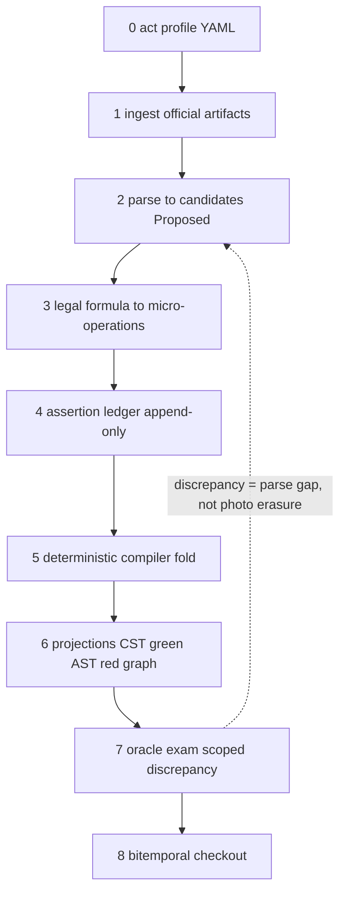
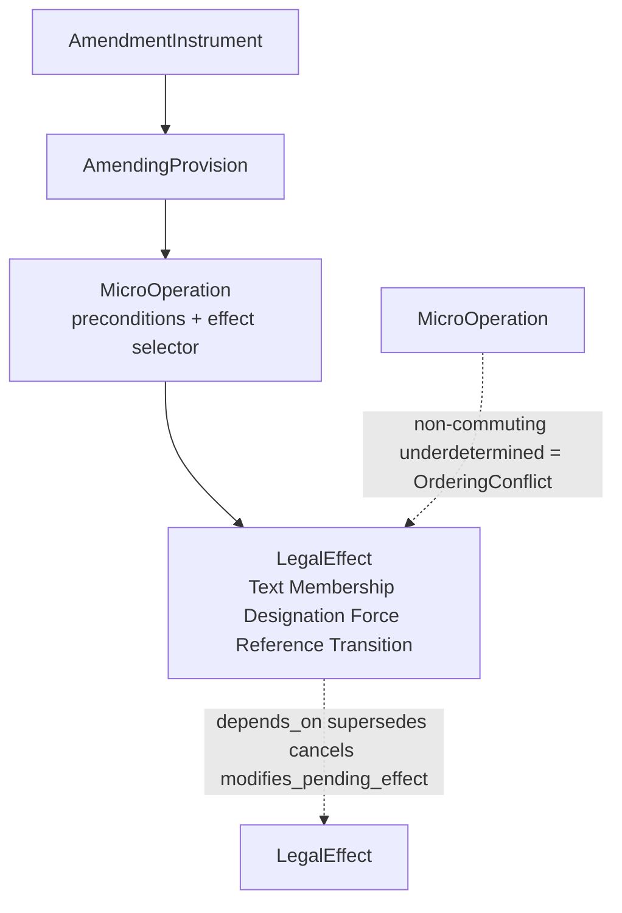
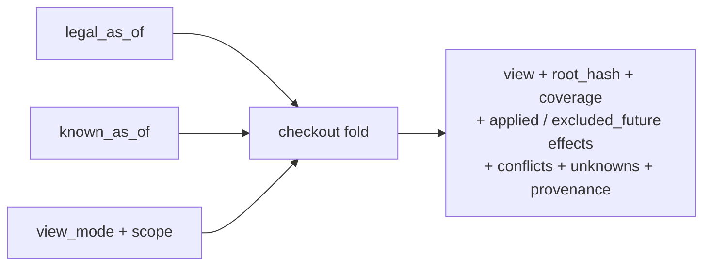

# Model Crystal — Reviews 10–14 projection

**Status:** `[proposed]` documentation-only projection. **Non-canon.** This file
amends no ADR, promotes no lifecycle, mints no Rust type, closes no TSG row.
Part D candidates of the source stay candidates until human disposition G0
(ADR-0024 L2).

**Source canon:** `doc/review/review-25-08-2026.md` (immutable L0) as the
historical source, with G0 ADR amendments (`doc/adr/0016..0019`,
`prd/temporal-legal-model.md`) as the canonical re-grounding after G0 (D216).
L0 digest — sha256:c438ddfbe67181d439b5ed69a91e0adca833a9b84d26f1f2d85ea848070ea1b8.
**Created:** 2026-08-20 (v1 pre-G0 at `b4c0d33`); **v2** re-grounded to G0
ADR amendments after D216 (see Grounding log).

**Verification:** governor check `model-crystal-anchors` (advisory `[bounded]`)
verifies the L0 digest and every `<!-- anchor: <src> ... "quote" -->` below
verbatim against the mapped source file (review or G0 ADR amendment). Drift =
visible warning, never silent.

**Reading contract:** inject Layer 0 always; Layer 1 by topic; read the source
reviews only on demand via anchors. Cite IDs (`INV-02`, `AXIS-4`, `OP-T`,
`RES-OrderingConflict`) in task briefs and slice plans instead of pasting
review prose. IDs are navigation anchors of this projection, not new domain
vocabulary: no `prd/temporal-legal-model.md` §3 row is created or amended.

---

## Layer 0 — always-inject core

### MC-F. Formula

<!-- anchor: adr-0017 G0(a) "append-only bitemporal ledger of" -->

```text
Evidence Vault
+ append-only bitemporal ledger of LegalEventAssertion
+ typed amendment algebra (Instrument → Provision → MicroOperation → Effect)
+ deterministic amendment compiler
= projections: lossless CST (green) + semantic legal AST (red)
  + temporal structure / reference graph
+ deterministic checkout(legal_as_of, known_as_of, view_mode)
```

Target name: **Bitemporal Legislative Event Compiler with Persistent Legal
Syntax DAG**. Git is an analogy of useful properties (content-addressing,
Merkle root, structural sharing), not domain identity:
`hash ≠ ComponentId`, `path ≠ ComponentId`, `similarity ≠ identity continuity`.

Three hard «no» of the formula:

<!-- anchor: adr-0017 G0(a) "never rewrites the" -->

1. **Snapshot ≠ commit** — a consolidated edition is an oracle/checksum
   (exam), never the source of history.
2. Extracted event ≠ legal fact — canon is a ledger of *assertions* with
   evidence span, status and `recorded_at`; late correction never rewrites
   past knowledge.
3. Projection ≠ truth — CST/AST/graph/slice are a deterministic fold of the
   ledger; root hash is reproducible; rebuild is equivalent.

### MC-AXES. Seven independent axes (anti-drift core)

| ID | Axis | Answers | Never answers |
|----|------|---------|---------------|
| AXIS-1 | ComponentIdentity (opaque `ComponentId`) | which piece, forever | number/path (that is DesignationVersion), force |
| AXIS-2 | TextVersion (CTV) | which wording between strikes | force, applicability |
| AXIS-3 | OperativeMembership | in the operative tree at t? | force by text, documentary presence |
| AXIS-4 | DocumentaryPresence | Tombstone / Present / Absent | legal force |
| AXIS-5 | ForceStatus (interval set) | InForce / NotYetInForce / Suspended / Repealed / … | text, applicability |
| AXIS-6 | TransitionConstraint | for which old relations the old version still applies | slot resurrection |
| AXIS-7 | Reference Mention/Binding/Semantics | who cited what, binding, mode | `amends`, target force, editorial re-pointing |

<!-- anchor: adr-0017 G0(f) "DocumentaryPresence is a separate repeal axis" -->

Inequalities (verbatim, unsimplifiable):

<!-- anchor: adr-0021 G0 "`TransitionConstraint` is a typed effect" -->

```text
текст существует        ≠  действует
принят/опубликован      ≠  вступил в силу          (vacatio: 44-ФЗ ст. 114)
действует               ≠  применим к делу         (ADR-0023)
компонент существует    ≠  входит в состав
ссылка существует       ≠  цель действует
Repealed-цель           ≠  сломанный биндинг
публикация              ≠  система знает
```

### MC-INV. Metamorphic acceptance invariants (INV-01..INV-10)

| ID | Invariant (one line) |
|----|----------------------|
| INV-01 | Repeated replay → same root hash. |
| INV-02 | Permutation of independent events does not change the snapshot. |
| INV-03 | Permutation of dependent events is forbidden or `OrderingConflict`. |
| INV-04 | Future effects never affect a historical checkout. |
| INV-05 | Assertion correction never rewrites the `known_as_of` past. |
| INV-06 | Changing a reference target does not change the source mention. |
| INV-07 | Changing source text closes the occurrence, may keep continuity. |
| INV-08 | Every snapshot node carries provenance or a typed Unknown. |
| INV-09 | Exact-text reconstruction reproduces the official artifact (via CST). |
| INV-10 | No `None` ever replaces a legally meaningful typed non-success. |

<!-- anchor: adr-0017 G0(d) "repeated replay" -->
<!-- anchor: temporal-model §14.5 "Permutation of independent events does not change the snapshot" -->

---

## Layer 1 — inject by topic

### MC-PIPE. Pipeline 0→8

<!-- anchor: adr-0013 G0 "Parser emits" -->



Stage bans (full table in source §B.2): candidate ≠ fact; no rewrite-in-place
in ledger; no hidden side effects in compiler; no oracle-tree-back as canon;
checkout never serves "latest" and never substitutes `None` for typed
non-success.

### MC-OPS. Closed operation registry (P1)

<!-- anchor: adr-0017 G0(g) "Text (`ReplaceText`" -->

| Family | Operations (names only) |
|--------|------------------------|
| OP-T (Text) | ReplaceText, InsertText, DeleteText, SubstituteRange, CorrectText |
| OP-S (Structural) | Attach, Detach, Move, Renumber, Redesignate, Split, Join, ReplaceStructure, ReserveDesignation |
| OP-F (Force) | Commence, Suspend, Resume, Repeal, Expire, Invalidate, Restore |
| OP-P (Prospective) | ScheduleEffect, ModifyPendingEffect, CancelPendingEffect |
| OP-L (Table/List) | InsertEntry, DeleteEntry, SplitEntry, MergeEntries, ReclassifyEntry |

Every operation carries: target selector, expected base version,
precondition, payload, effect selector, scope, postcondition, evidence span.

### MC-RES. Typed apply results (closed set)

`Applied | TargetNotFound | AmbiguousTarget | PreconditionMismatch |
BaseVersionMismatch | OrderingConflict | UnknownEffect |
UnsupportedOperation | IncompleteSource`

<!-- anchor: adr-0017 G0(c) "non-commuting underdetermined effects yield" -->

### MC-SEL. EffectSelector modes

At / AfterPublication / OnEvent / OnCondition / ForRelationsAfter /
RetroactiveTo / Unknown. These are projections of the five-clock roles
(ADR-0009), **not a sixth clock**.

### MC-DAG. Causal order — DAG, not queue

<!-- anchor: adr-0017 G0(b) "Instrument" -->



Linear order is only a proven projection of the DAG; never order by act
number.

### MC-SEED. Seed = four different events

<!-- anchor: adr-0018 G0(a) "EntryIntoForceEvent" -->

AdoptionEvent (created text) / OfficialPublicationEvent (authoritative
expression) / EntryIntoForceEvent(s) (per-component commence) /
ApplicabilityConstraint (out of this contour, ADR-0023). Default seed force:
`NotYetInForce` or `Unknown` — **never** automatic `InForce`. Text can already
be amended during vacatio (44-ФЗ art. 114 + 188-ФЗ).

### MC-REPEAL. Repeal = four axes, not detach

ForceStatus = Repealed; OperativeMembership = Absent; DocumentaryPresence =
Tombstone; TextAvailability = HistoricalOnly (last CTV stays citable). Child
cascade is a derived `RepealScope(parent, descendants=true)`, not physical
deletion of child ids.

<!-- anchor: adr-0017 G0(f) "TextAvailability = HistoricalOnly" -->

### MC-ID. Identity floors

| Floor | Identity | Notes |
|-------|----------|-------|
| act | Work = number + date + authority (ADR-0016) | number alone is never identity |
| numbered component | opaque `ComponentId`; path/label/eId/wId = DesignationVersion | AKN wId/eId, ELI URI = compatibility projections (D046) |
| addressable unnumbered paragraph | `AddressableTextUnit` + `IdentityContinuityDecision` (SameComponent / SplitFrom / MergedFrom / ReplacedByNewIdentity / IdentityUncertain) | |
| word/phrase | version-local `TextAnchor` (token span + quoted_hash) | |

<!-- anchor: adr-0017 G0(e) "identifies an unnumbered" -->

### MC-LEDGER. Assertion lifecycle

<!-- anchor: adr-0017 G0(a) "AuthoritativeInternal" -->

Statuses: Proposed / Validated / AuthoritativeInternal / Rejected /
Superseded, plus `recorded_at` and `asserted_by`. Correction = new immutable
assertion + rebuilt projection; never in-place rewrite.

### MC-CHECKOUT. Bitemporal checkout

<!-- anchor: adr-0017 G0(d) "checkout(work, legal_as_of, known_as_of" -->

```text
Snapshot = fold(
    assertions
    where recorded_at <= known_as_of
      and status in {Validated, AuthoritativeInternal}
      and effect_selector satisfied for legal_as_of
)
```



Views: VIEW-Promulgated (authoritative text), VIEW-Operative (in force at t),
VIEW-HistoricalCitation (incl. repealed + tombstone), VIEW-Reference
(mentions/bindings/target states); VIEW-CaseApplicable — later, ADR-0023
runtime.

<!-- anchor: review §C "PromulgatedTextView" -->

### MC-REF. Reference binding modes

Mention (span + wording in a specific CTV) / Binding (candidate or confirmed
target + evidence + status; a successful binding is not destroyed by a
Repealed target) / Semantics modes: IdentityAmbulatory / DesignationLiteral /
FixedExpression / AsOfSpecifiedDate / EventRelative / **Unclassified
(default)**.

<!-- anchor: adr-0019 G0 "IdentityAmbulatory" -->

### MC-GOLDEN. Golden list (P0 item 9, list only)

15–20 golden cases: vacatio (44-ФЗ/188-ФЗ), prospective effect, identity
collision, bitemporal correction, tombstone, ambulatory vs fixed cites, two
events on the same day. Semantic-shape oracles, not legal truth.

---

## Reality boundary (on crystal creation HEAD)

On HEAD there is **no** ledger, no compiler, no CST, no bitemporal checkout,
no resolver phases 2–3, no `NotYetInForce` in runtime. Present: oracle-anchored
assembly `S_ready_bounded` (drift=0), mention phase 1 `[bounded]`, YAML edge
vocabulary, `amends` constructors, bounded force-timeline in `ln-temporal`.

<!-- anchor: review §Non-claims "NotYetInForce" -->

## Non-claims

- This file is a projection. It does not amend ADR-0016..0023 beyond the
  G0 amendments already recorded (D216), does not close TSG-002/003/012/013/017,
  does not move `fsm.current` / O3 / TSG-017 S4.
- IDs are citation anchors of this projection, not glossary rows; no public
  contract or Rust type may be inferred from them.
- Mermaid diagrams are shape aids; the algebra lives in the owning ADR
  amendments and in the tables above.
- The governor check is advisory (`warn`); it never blocks and never promotes.

## Grounding log

| Version | Date | Anchored to | Source digest | HEAD |
|---------|------|-------------|---------------|------|
| v1 | 2026-08-20 | review-25 (pre-G0) | sha256:c438ddfbe67181d439b5ed69a91e0adca833a9b84d26f1f2d85ea848070ea1b8 | b4c0d33 |
| v2 | 2026-08-20 | G0 ADR amendments (D216): adr-0013/0016/0017/0018/0019 + temporal-model; historical anchors stay on review | sha256:c438ddfbe67181d439b5ed69a91e0adca833a9b84d26f1f2d85ea848070ea1b8 | 26095dc+ |

v2 (D216) moved the model-definition anchors from the L0 review to the
canonical G0 ADR amendments; historical/reality-boundary and non-claim anchors
stay on the immutable review. The governor check now resolves anchors across
the multi-source canon and warns on drift.

<!-- anchor: review §Non-claims "закон в Git не хранится" -->
