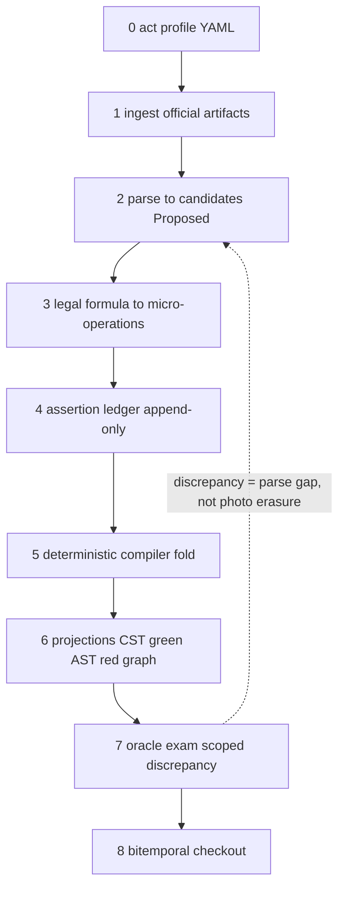
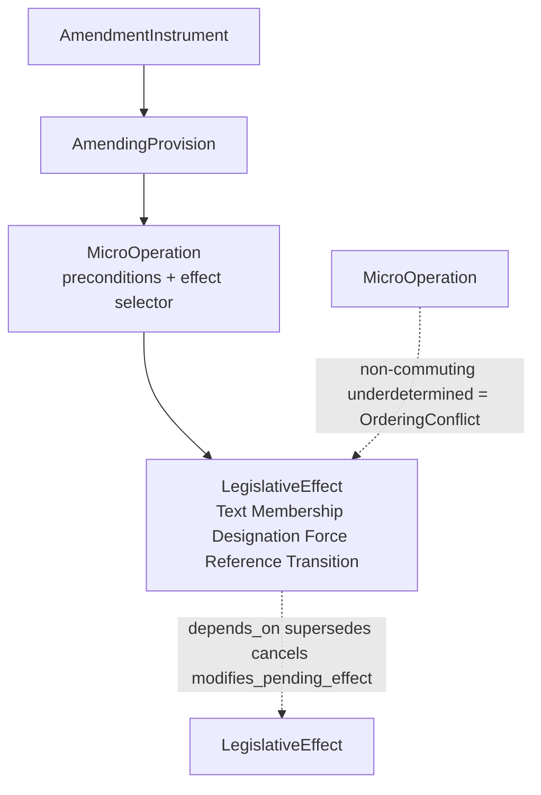
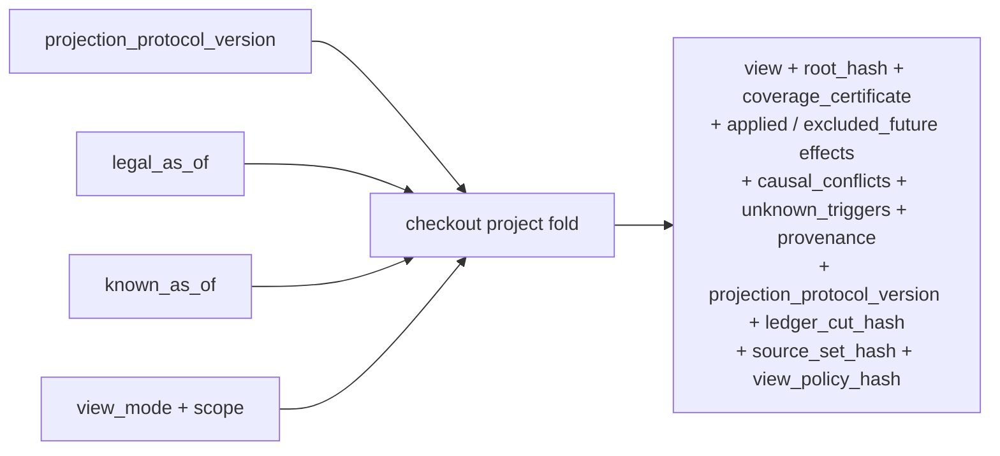

# Model Crystal — Reviews 10–14 projection

**Status:** `[proposed]` documentation-only projection. **Non-canon.** This file
amends no ADR, promotes no lifecycle, mints no Rust type, closes no TSG row.
Part D candidates were disposed by human G0 (D216); their canonical substance
now lives in the G0 ADR amendments (`doc/adr/0013/0016/0017/0018/0019`,
`prd/temporal-legal-model.md`).

**Source canon:** `doc/review/review-25-08-2026.md` (immutable L0) as the
historical source, with G0 ADR amendments (`doc/adr/0016..0019`,
`prd/temporal-legal-model.md`) as the canonical re-grounding after G0 (D216).
L0 digest — sha256:c438ddfbe67181d439b5ed69a91e0adca833a9b84d26f1f2d85ea848070ea1b8.
**Created:** 2026-08-20 (v1 pre-G0 at `b4c0d33`); **v2** re-grounded to G0
ADR amendments after D216 (see Grounding log).

**Verification:** governor check `model-crystal-anchors` (advisory `[bounded]`)
verifies the L0 digest and every `<!-- anchor: <src> ... "quote" -->` below
verbatim against the mapped source file (review or G0 ADR amendment). Drift =
visible warning, never silent.

**Reading contract:** inject Layer 0 always; Layer 1 by topic; read the source
reviews only on demand via anchors. Cite IDs (`INV-02`, `AXIS-4`, `OP-T`,
`RES-OrderingConflict`) in task briefs and slice plans instead of pasting
review prose. IDs are navigation anchors of this projection, not new domain
vocabulary: no `prd/temporal-legal-model.md` §3 row is created or amended.

---

## Layer 0 — always-inject core

### MC-F. Formula

<!-- anchor: adr-0017 G0(a) "append-only bitemporal ledger of" -->

```text
Evidence Vault
+ append-only bitemporal ledger of LegalEventAssertion
+ typed amendment algebra (Instrument → Provision → MicroOperation → Effect)
+ deterministic amendment compiler
= projections: lossless CST (green) + semantic legal AST (red)
  + temporal structure / reference graph
+ deterministic checkout(legal_as_of, known_as_of, view_mode)
```

Living checkout key includes `projection_protocol_version` (review-26 P0-2 / INV-11).

Target name: **Bitemporal Legislative Event Compiler with Persistent Legal
Syntax DAG**. Git is an analogy of useful properties (content-addressing,
Merkle root, structural sharing), not domain identity:
`hash ≠ ComponentId`, `path ≠ ComponentId`, `similarity ≠ identity continuity`.

Three hard «no» of the formula:

<!-- anchor: adr-0017 G0(a) "never rewrites the" -->

1. **Snapshot ≠ commit** — a consolidated edition is an oracle/checksum
   (exam), never the source of history.
2. Extracted event ≠ legal fact — canon is a ledger of *assertions* with
   evidence span, status and `recorded_at`; late correction never rewrites
   past knowledge.
3. Projection ≠ truth — CST/AST/graph/slice are a deterministic fold of the
   ledger; root hash is reproducible; rebuild is equivalent.

### MC-SEPARATION. Independent semantic planes

MC-AXES and AXIS-1..AXIS-7 remain historical navigation aliases of this table;
they are not a second living set.

| Plane | Answers | Never answers | Was |
|-------|---------|---------------|-----|
| Identity | opaque `WorkId` / `ComponentId` / `TextUnitId` — which piece, forever | number/path (that is Designation), force | AXIS-1 ComponentIdentity |
| Designation | number, label, path, eId, wId, URI | identity, force | new (previously folded into AXIS-1 notes) |
| SourceExpression | official expression, manifestation, rendition | text-content identity, force | new |
| TextContent | CTV / which wording between strikes | force, applicability | AXIS-2 TextVersion |
| StructuralMembership | parent, order, attach/detach/move — in the tree at t? | force-by-text, editorial presence | AXIS-3 OperativeMembership |
| EditorialPresence | Present / Tombstone / Absent in a concrete expression/view | legal force | AXIS-4 DocumentaryPresence |
| Force | interval-set InForce / NotYetInForce / Suspended / Repealed / … | text, applicability | AXIS-5 ForceStatus |
| TransitionConstraint | for which old relations the old version still applies — source-grounded constraint with own valid/transaction anchors | slot resurrection; not an independent temporal axis | AXIS-6 |
| ReferenceMention | literal source span | `amends`, target force | AXIS-7 split |
| ReferenceBinding | target resolution | editorial re-pointing as identity | AXIS-7 split |
| ReferenceSemantics | relation kind and temporal binding mode | target force | AXIS-7 split |
| AssertionKnowledge | evidence, disposition, conflict, known-as-of | force, membership | new |

Living-name overlay (review-26 §3, design-only, lifecycle `[proposed]`):
StructuralMembership is the living name of historical OperativeMembership;
EditorialPresence is the living name of historical DocumentaryPresence (the
review-26 alternative ExpressionPresence is not adopted); TransitionConstraint
is a first-class data plane with its own valid/transaction anchors, not an
independent temporal axis; the historical AXIS-N labels remain citation
aliases.

<!-- anchor: adr-0017 G0(f) "DocumentaryPresence is a separate repeal axis" -->

Inequalities (verbatim, unsimplifiable):

<!-- anchor: adr-0021 G0 "`TransitionConstraint` is a typed effect" -->

```text
текст существует        ≠  действует
принят/опубликован      ≠  вступил в силу          (vacatio: 44-ФЗ ст. 114)
действует               ≠  применим к делу         (ADR-0023)
компонент существует    ≠  входит в состав
ссылка существует       ≠  цель действует
Repealed-цель           ≠  сломанный биндинг
публикация              ≠  система знает
```

### MC-INV. Metamorphic acceptance invariants (INV-01..INV-11 and INV-22)

| ID | Invariant (one line) |
|----|----------------------|
| INV-01 | Repeated replay → same root hash. |
| INV-02 | Permutation of independent events does not change the snapshot. |
| INV-03 | Permutation of dependent events is forbidden or `OrderingConflict`. |
| INV-04 | Future effects never affect a historical checkout. |
| INV-05 | Assertion correction never rewrites the `known_as_of` past. |
| INV-06 | Changing a reference target does not change the source mention. |
| INV-07 | Changing source text closes the occurrence, may keep continuity. |
| INV-08 | Every snapshot node carries provenance or a typed Unknown. |
| INV-09a | ArtifactPreservation: original official-artifact bytes remain retrievable by artifact_hash. |
| INV-09b | SourceTextRoundTrip: source CST reproduces canonical text under an explicit normalization profile. |
| INV-09c | ProjectionAgreement: reconstructed expression agrees with the authoritative oracle for a chosen scope and normalization profile. |
| INV-10 | No `None` ever replaces a legally meaningful typed non-success. |
| INV-11 | Projection protocol determinism: identical ledger cut + source set + protocol version + view policy + request → same snapshot hash. |
| INV-22 | Root hash without coverage proof is not a completeness claim. |

*review-26 also names INV-12..21; they stay L0 until an owning slice catalogs them.*

<!-- anchor: adr-0017 G0(d) "repeated replay" -->
<!-- anchor: temporal-model §14.5 "Permutation of independent events does not change the snapshot" -->

---

## Layer 1 — inject by topic

### MC-PIPE. Pipeline 0→8

<!-- anchor: adr-0013 G0 "Parser emits" -->



Stage bans (full table in source §B.2): candidate ≠ fact; no rewrite-in-place
in ledger; no hidden side effects in compiler; no oracle-tree-back as canon;
checkout never serves "latest" and never substitutes `None` for typed
non-success.

### MC-OPS. Closed operation registry (P1)

<!-- anchor: adr-0017 G0(g) "Text (`ReplaceText`" -->

| Family | Operations (names only) |
|--------|------------------------|
| OP-T (Text) | ReplaceText, InsertText, DeleteText, SubstituteRange, CorrectText |
| OP-S (Structural) | Attach, Detach, Move, Renumber, Redesignate, Split, Join, ReplaceStructure, ReserveDesignation |
| OP-F (Force) | Commence, Suspend, Resume, Repeal, Expire, Invalidate, Restore |
| OP-P (Prospective) | ScheduleEffect, ModifyPendingEffect, CancelPendingEffect |
| OP-L (Table/List) | InsertEntry, DeleteEntry, SplitEntry, MergeEntries, ReclassifyEntry |

Every operation carries: target selector, expected base version,
precondition, payload, effect selector, scope, postcondition, evidence span.
Per-operation design data (preconditions / postconditions / typed failures):
`prd/architecture/operation-registry.yaml` — design-only YAML-as-data (D222),
lifecycle `[proposed]`, `authoritative: false`.

Force interval-set entity contract (E.2.4): `ForceInterval` /
`ForceIntervalSet` — design-only YAML-as-data in
`prd/architecture/force-interval-set-contract.yaml` (ADR-0018 G0(b),
lifecycle `[proposed]`). OP-F names stay registry-only; AXIS-5 ForceStatus
remains the interval-set axis; MC-SEED no-auto-InForce, MC-REPEAL four-axis,
and INV-04 excluded-future boundaries are unchanged.

### MC-RES. Typed apply results (closed set)

`Applied | TargetNotFound | AmbiguousTarget | PreconditionMismatch |
BaseVersionMismatch | OrderingConflict | UnknownEffect |
UnsupportedOperation | IncompleteSource`

<!-- anchor: adr-0017 G0(c) "non-commuting underdetermined effects yield" -->

### MC-SEL. EffectSelector modes

At / AfterPublication / OnEvent / OnCondition / ForRelationsAfter /
RetroactiveTo / Unknown. These are projections of the five-clock roles
(ADR-0009), **not a sixth clock**.

Living overlay (review-26 P0-4 / D252; citation known-lag, list above not
rewritten): the living ActivationTrigger 6-set is `At` /
`AfterPublication` / `OnEvent` / `OnCondition` / `RetroactiveTo` /
`Unknown`. `ForRelationsAfter` is a TransitionPredicate
(`RelationsArisingOnOrAfter`) on the TransitionConstraint plane, not a
selector mode. YAML `prd/architecture/operation-registry.yaml` is the
definition surface.

### MC-DAG. Causal order — DAG, not queue

<!-- anchor: adr-0017 G0(b) "Instrument" -->



Linear order is only a proven projection of the DAG; never order by act
number.

Naming: the living name of the typed effect node is `LegislativeEffect`
(review-26 P0-1; additive naming note in
`doc/adr/0017-component-temporal-versioning.md` G0(b)); the historical G0(b)
wording `LegalEffect` is retained unchanged.

Pending-effects design data (E.2.3 entities, FSM, `modifies_pending_effect`
edge disambiguated from the OP-P operation):
`prd/architecture/pending-effects-contract.yaml` — design-only YAML-as-data
(D222/D226), lifecycle `[proposed]`, owner ADR-0017. The OP-P operation
names stay in the registry above; checkout exclusion of unsatisfied
scheduled effects is the INV-04 fold.

### MC-SEED. Seed = four different events

<!-- anchor: adr-0018 G0(a) "EntryIntoForceEvent" -->

AdoptionEvent (created text) / OfficialPublicationEvent (authoritative
expression) / EntryIntoForceEvent(s) (per-component commence) /
ApplicabilityConstraint (out of this contour, ADR-0023). Default seed force:
`NotYetInForce` or `Unknown` — **never** automatic `InForce`. Text can already
be amended during vacatio (44-ФЗ art. 114 + 188-ФЗ).

### MC-REPEAL. Repeal = four axes, not detach

ForceStatus = Repealed; OperativeMembership = Absent; DocumentaryPresence =
Tombstone; TextAvailability = HistoricalOnly (last CTV stays citable). Child
cascade is a derived `RepealScope(parent, descendants=true)`, not physical
deletion of child ids. Living names (review-26 §3): StructuralMembership /
EditorialPresence; historical OperativeMembership / DocumentaryPresence
retained.

<!-- anchor: adr-0017 G0(f) "TextAvailability = HistoricalOnly" -->

### MC-ID. Identity floors

| Floor | Identity | Notes |
|-------|----------|-------|
| act | historical G0 wording (D216) retained: Work = number + date + authority (ADR-0016); living overlay (review-26 §4, design-only, lifecycle `[proposed]`): opaque WorkId is the persistent internal identifier of a Work, symmetric with opaque ComponentId | number / date / authority / act_type / jurisdiction / source / recorded_at live on `OfficialIdentityClaim` as the natural key for reconciliation, not the internal identifier; number alone is never identity |
| numbered component | opaque `ComponentId`; path/label/eId/wId = DesignationVersion | AKN wId/eId, ELI URI = compatibility projections (D046) |
| addressable unnumbered paragraph | `AddressableTextUnit` + `IdentityContinuityDecision` (SameComponent / SplitFrom / MergedFrom / ReplacedByNewIdentity / IdentityUncertain) | |
| word/phrase | version-local `TextAnchor` (token span + quoted_hash) | |

<!-- anchor: adr-0017 G0(e) "identifies an unnumbered" -->

### MC-LEDGER. Assertion lifecycle

<!-- anchor: adr-0017 G0(a) "AuthoritativeInternal" -->

Statuses: Proposed / Validated / AuthoritativeInternal / Rejected /
Superseded, plus `recorded_at` and `asserted_by`. Correction = new immutable
assertion + rebuilt projection; never in-place rewrite.

The closed five statuses, the three-rung promotion path without skip
(Proposed → Validated → AuthoritativeInternal), the skip-ban table and the
INV-05 append-only correction invariant live in
`prd/architecture/assertion-lifecycle-contract.yaml` (design-only companion
data, E.2.7, lifecycle `[proposed]`) — a navigation pointer under MC-LEDGER,
not a new anchor source.

Living adjudicative overlay (additive note after review-26 P0-3,
design-only, lifecycle `[proposed]`, owner ADR-0017 G0(a)): the same
`prd/architecture/assertion-lifecycle-contract.yaml` also carries the living
adjudicative entities `ValidationReceipt`, `AssertionDispositionEvent` and
`AssertionRelation`, the closed disposition 4-set AcceptedForProjection /
Quarantined / Rejected / Retired, and the closed relation-kind 6-set Supports
/ Contradicts / Corrects / Supersedes / Duplicates / Qualifies. In that
overlay AcceptedForProjection is the living alias of the projection-status slot
AuthoritativeInternal: not a sixth status, not a rename of the five statuses
above; CanonicalInternal is not a living name. This note remains a navigation
pointer under MC-LEDGER, not a new anchor source.

The ledger evidence span (`evidence_span`) is the P0-7 EvidenceAnchor /
EvidenceBundle contract at `prd/architecture/evidence-anchor-contract.yaml`.

### MC-CHECKOUT. Bitemporal checkout

<!-- anchor: adr-0017 G0(d) "checkout(work, legal_as_of, known_as_of" -->

```text
Snapshot = project(
    projection_protocol_version,
    legal_as_of,
    known_as_of,
    view_mode,
    scope,
    assertions = { a | a.recorded_at <= known_as_of
                   AND disposition_as_of(a, known_as_of) = AcceptedForProjection },
    effects = causal_close(compile(assertions),
        trigger_state_as_of = known_as_of, legal_as_of = legal_as_of)
)
Result payload names: projection_protocol_version, ledger_cut_hash,
source_set_hash, view_policy_hash, root_hash
(= ProjectionRoots.composed_checkout_root), coverage_certificate,
causal_conflicts, unknown_triggers.
```



Named-view set — living overlay (review-26 §7; design-only, lifecycle
`[proposed]`): VIEW-SourceExpression(expression_id) — exact text of one
official expression/artifact (the expression_id parameterization stays prose,
not an API signature and not a YAML token); VIEW-DerivedConsolidation — a
derived consolidation synthesized from the ledger; VIEW-Operative — components
and texts in force at t; VIEW-HistoricalCitation — historical text incl.
repealed + tombstone; VIEW-PendingEffects — adopted but not-yet-activated,
changed or repealed prospective effects; VIEW-Reference —
mentions/bindings/target states; VIEW-ChangeTrace — amendment instrument →
provision → instruction → effect → projection node; VIEW-Discrepancy —
difference between the reconstructed expression and the edition oracle.
Historical checkout-key tokens are retained beside this set: review-25 Part C /
adr-0017 G0(d) `view_mode` keeps VIEW-Promulgated / PromulgatedTextView as
checkout-key tokens of the source-text family, and the E.2.5 YAML closed four
[Promulgated, Operative, HistoricalCitation, Reference] is that checkout key,
not this named-view catalog; where the historical key said only Promulgated,
the living names distinguish SourceExpression vs DerivedConsolidation.
known_as_of is a required parameter of every projection, never a view.
VIEW-CaseApplicable remains ADR-0023 runtime. Qualifiers: the MC-SEPARATION
plane SourceExpression (official expression, manifestation, rendition) is not
the checkout projection VIEW-SourceExpression; VIEW-PendingEffects is a named
projection, not the YAML entity PendingEffect / ProspectiveVersion.

<!-- anchor: review §C "PromulgatedTextView" -->

Per-scope required fields, closed completeness outcomes and the scope × gap
table live in `prd/architecture/scope-aware-completeness-contract.yaml`
(design-only companion data, E.2.5, lifecycle `[proposed]`) — a navigation
pointer, not a new anchor source. MC-CHECKOUT keeps the INV-08 (provenance
or typed Unknown) and INV-10 (no `None` outcome) boundaries; the
contract's WholeAct row preserves the ADR-0017 §4 any-gap-blocks rule, and
an out-of-scope unknown is reported, never blocking. Living overlay
(review-26 P0-8): the same YAML also carries the third entity
CoverageCertificate (closed closure dimensions and verdicts CompleteFor /
IncompleteBecause); CompletenessReport.coverage stays the assembly metric;
per INV-22 a root hash without that certificate is not a completeness claim.

The materialized-section checkout key, closed root kinds (CstRoot /
AstRoot / OracleExamBinding) and INV-01 rebuild-equivalence live in
`prd/architecture/merkle-roots-contract.yaml` (design-only companion data,
E.2.6, lifecycle `[proposed]`) — a navigation pointer, not a new anchor
source. MC-CHECKOUT singular `root_hash` is
`ProjectionRoots.composed_checkout_root`, not a CompletenessReport field.

### MC-REF. Reference binding modes

Mention (span + wording in a specific CTV) / Binding (candidate or confirmed
target + evidence + status; a successful binding is not destroyed by a
Repealed target) / Semantics modes: IdentityAmbulatory / DesignationLiteral /
FixedExpression / AsOfSpecifiedDate / EventRelative / **Unclassified
(default)**. Per-entity required fields, closed typed non-success sets and
strike behavior for these three entities live in
`prd/architecture/reference-binding-contract.yaml` (design-only companion
data, E.2.2, lifecycle `[proposed]`) — a navigation pointer, not a new anchor
source.

<!-- anchor: adr-0019 G0 "IdentityAmbulatory" -->

### MC-GOLDEN. Golden list (P0 item 9, list only)

15–20 golden cases: vacatio (44-ФЗ/188-ФЗ), prospective effect, identity
collision, bitemporal correction, tombstone, ambulatory vs fixed cites, two
events on the same day. Semantic-shape oracles, not legal truth.

---

## Reality boundary (on crystal creation HEAD)

On HEAD there is **no** ledger, no compiler, no CST, no bitemporal checkout,
no resolver phases 2–3, no `NotYetInForce` in runtime. Present: oracle-anchored
assembly `S_ready_bounded` (drift=0), mention phase 1 `[bounded]`, YAML edge
vocabulary, `amends` constructors, bounded force-timeline in `ln-temporal`.

<!-- anchor: review §Non-claims "NotYetInForce" -->

## Non-claims

- This file is a projection. It does not amend ADR-0016..0023 beyond the
  G0 amendments already recorded (D216), does not close TSG-002/003/012/013/017,
  does not move `fsm.current` / O3 / TSG-017 S4.
- IDs are citation anchors of this projection, not glossary rows; no public
  contract or Rust type may be inferred from them.
- Mermaid diagrams are shape aids; the algebra lives in the owning ADR
  amendments and in the tables above.
- The governor check is advisory (`warn`); it never blocks and never promotes.

## Grounding log

| Version | Date | Anchored to | Source digest | HEAD |
|---------|------|-------------|---------------|------|
| v1 | 2026-08-20 | review-25 (pre-G0) | sha256:c438ddfbe67181d439b5ed69a91e0adca833a9b84d26f1f2d85ea848070ea1b8 | b4c0d33 |
| v2 | 2026-08-20 | G0 ADR amendments (D216): adr-0013/0016/0017/0018/0019 + temporal-model; historical anchors stay on review | sha256:c438ddfbe67181d439b5ed69a91e0adca833a9b84d26f1f2d85ea848070ea1b8 | 26095dc+ |
| v3 | 2026-08-24 | review-26 §3 living overlay (M182 S01): MC-SEPARATION heading + 12 semantic planes; living names StructuralMembership / EditorialPresence; MC-AXES / AXIS-N remain historical aliases; no new anchor source, review-25 digest unchanged | sha256:c438ddfbe67181d439b5ed69a91e0adca833a9b84d26f1f2d85ea848070ea1b8 | 1d16782+ |
| v4 | 2026-08-24 | review-26 §4 living overlay (M182 S02): MC-ID act-row opaque WorkId / OfficialIdentityClaim as natural key for reconciliation; historical D216 Work = number + date + authority retained; no new anchor source, review-25 digest unchanged | sha256:c438ddfbe67181d439b5ed69a91e0adca833a9b84d26f1f2d85ea848070ea1b8 | 2cf0ce4+ |
| v5 | 2026-08-24 | review-26 §7 living overlay (M182 S03): MC-CHECKOUT named VIEW set; historical VIEW-Promulgated / PromulgatedTextView retained as checkout-key; known_as_of is a parameter not a view; no new anchor source, review-25 digest unchanged | sha256:c438ddfbe67181d439b5ed69a91e0adca833a9b84d26f1f2d85ea848070ea1b8 | 1fa8279+ |

v2 (D216) moved the model-definition anchors from the L0 review to the
canonical G0 ADR amendments; historical/reality-boundary and non-claim anchors
stay on the immutable review. The governor check now resolves anchors across
the multi-source canon and warns on drift.

<!-- anchor: review §Non-claims "закон в Git не хранится" -->
