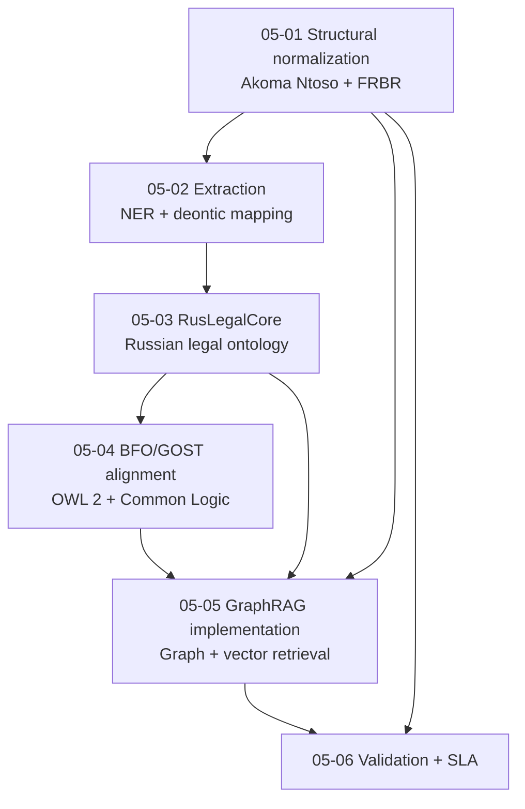

# Architecture Requirement Groups from Research Document 05

This directory decomposes the research document into architecture requirement groups. Requirement identifiers use the requested scheme `05-<group-index>-<internal-number>`.

## Groups

| Group | File | Focus |
|---|---|---|
| 05-01 | [Structural normalization and Akoma Ntoso](05-01-structural-normalization-akoma-ntoso.md) | Legal document preprocessing, FRBR, URI/IRI atomization, RusLawOD transformation |
| 05-02 | [Entity extraction and deontic mapping](05-02-entity-extraction-deontic-mapping.md) | NER, RuBERT-CRF, Russian prescriptive language, LKIF modality mapping |
| 05-03 | [RusLegalCore domain ontology and collisions](05-03-ruslegalcore-domain-ontology-collisions.md) | Russian legal hierarchy, federal structure, judicial interpretation, legal conflict resolution |
| 05-04 | [BFO/GOST alignment and formal logic](05-04-bfo-gost-alignment-formal-logic.md) | GOST R 59798-2021, BFO continuant/occurrent mapping, OWL 2, Common Logic |
| 05-05 | [Ontology-driven GraphRAG and storage](05-05-ontology-driven-graphrag-storage.md) | Graph/vector storage, temporal version aggregation, HNSW + Cypher retrieval |
| 05-06 | [Validation, scalability, and SLA](05-06-validation-scalability-sla.md) | Pilot validation, parser anomalies, performance requirements, context compression |

## Cross-group dependency map

## Notes

- These are architecture requirements extracted from research; they are not implementation proof.
- Capability claims involving FalkorDB scale, parser completeness, generated Cypher safety, legal answer correctness, or LLM authority still require separate repository/runtime evidence before being treated as validated architecture.
