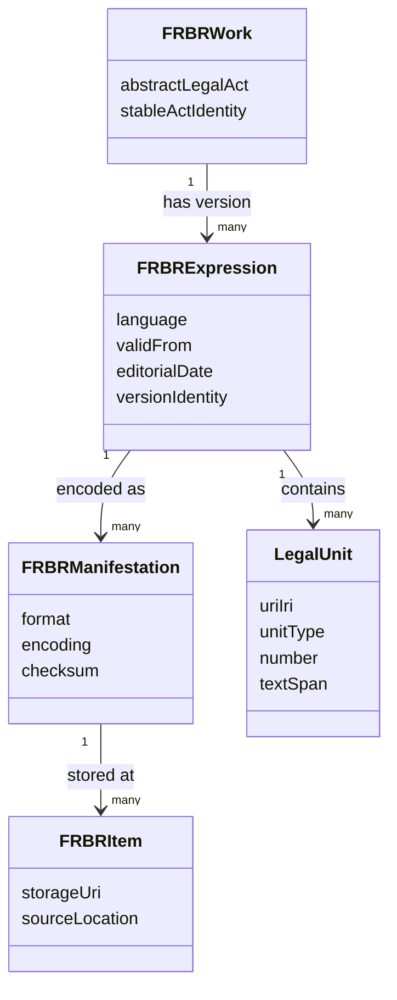

# 05-01 — Structural normalization and Akoma Ntoso

## Scope

This group covers the preprocessing layer that turns Russian legal texts into stable, addressable, machine-readable legal document structures before semantic extraction begins.

## Requirements

### 05-01-01 — Use Akoma Ntoso as the structural normalization target

The pipeline MUST normalize legal source documents into an Akoma Ntoso / LegalDocML-compatible representation that separates document content, metadata, and visual presentation.

**Rationale:** The research identifies Akoma Ntoso as the structural foundation needed before graph vectorization and semantic processing.

### 05-01-02 — Represent legal identity through the FRBR model

The document model MUST distinguish FRBR Work, Expression, Manifestation, and Item so that an abstract legal act, a dated version, a concrete file format, and a physical/network location are not conflated.

**Rationale:** Russian legislation changes frequently; deterministic retrieval requires routing requests from the abstract act to the currently valid expression.

### 05-01-03 — Preserve temporal legal versions at the structural layer

The preprocessing layer MUST preserve dated legal expressions and amendments instead of overwriting prior versions.

**Rationale:** The research explicitly ties FRBR Expression to legal editorial history and current-status retrieval.

### 05-01-04 — Transform weakly structured RusLawOD-style sources into full legal structure

If the source corpus contains only high-level tags such as `act`, the pipeline MUST add explicit sections, chapters, articles, clauses, and other legal subdivisions.

**Rationale:** The research states that RusLawOD is not fully Akoma Ntoso-compatible and needs an intermediate transformation layer.

### 05-01-05 — Assign globally stable identifiers to structural legal units

Each normalized structural component MUST receive a globally unique URI/IRI suitable for graph nodes, citations, and vector chunk identity.

**Rationale:** Atomic identifiers enable precise citation, graph edges, and embeddings at the level of a legal unit rather than the whole document.

### 05-01-06 — Benchmark structural transformation at corpus scale

The XSLT or equivalent transformation processor SHOULD be benchmarked on a representative sample before full-corpus use.

**Rationale:** The research calls out the computational complexity of parsing hundreds of thousands of documents and handling anomalies such as missing numbering.

## Suggested structural model

## Open proof needs

- Verify whether the current project source corpus can be transformed into the required unit hierarchy without lossy heuristics.
- Produce real-document evidence for malformed numbering, nested clauses, tables, annexes, and amendment formulas.
