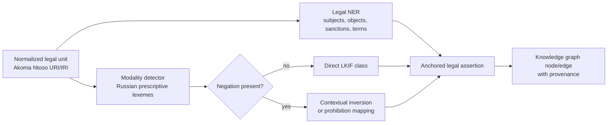

# 05-02 — Entity extraction and deontic mapping

## Scope

This group covers extraction of legal entities and prescriptive meaning from normalized Russian legal text.

## Requirements

### 05-02-01 — Extract legal entities from normalized structural units

The extraction layer MUST identify legally relevant entities such as subjects, objects, sanctions, deadlines, and other normative participants from each normalized legal unit.

**Rationale:** The research treats entity extraction as the bridge from XML structure to a multidimensional legal knowledge graph.

### 05-02-02 — Use a Russian legal-domain NER model or equivalent proof-backed extractor

The extraction layer SHOULD use a Russian legal-domain model such as RuBERT-CRF trained or evaluated on legal datasets such as RuLegalNER, or an equivalent extractor with repository evidence.

**Rationale:** General-purpose extraction is unlikely to reliably capture Russian legal entities and normative relations.

### 05-02-03 — Map Russian prescriptive language into LKIF deontic classes

The pipeline MUST map Russian prescriptive expressions into LKIF-compatible classes: `Obligation`, `Permission`, and `Prohibition`.

**Rationale:** The research identifies deontic mapping as critical for translating natural-language legal duties and permissions into graph semantics.

### 05-02-04 — Maintain a formal lexeme-to-modality mapping table

The system MUST maintain an explicit table mapping Russian legal expressions to deontic classes, including at least obligation, permission, and prohibition cues.

**Examples from the research:**

| LKIF class | Russian cue examples |
|---|---|
| `lkif:Obligation` | обязан, должен, надлежит, необходимо, возлагается обязанность |
| `lkif:Permission` | вправе, может, имеет право, допускается |
| `lkif:Prohibition` | запрещается, нельзя, не допускается, не вправе, не может |

### 05-02-05 — Treat negation as a first-class semantic operation

The extraction layer MUST detect negation and invert or transform deontic meaning where required, for example from permission-like wording to prohibition-like meaning.

**Rationale:** The research explicitly states that incorrect negation handling can change legal inference results.

### 05-02-06 — Preserve extraction provenance for every semantic assertion

Each extracted entity, modality, and deontic assertion SHOULD retain provenance back to a legal unit URI/IRI and source text span.

**Rationale:** Downstream legal retrieval must be citation-safe and auditable; LLM-generated interpretations must not become unanchored authority.

## Deontic mapping flow

## Open proof needs

- Validate the deontic mapping table on real Russian legal text.
- Measure false positives for words such as `может`, which may be permissive, descriptive, or procedural depending on context.
