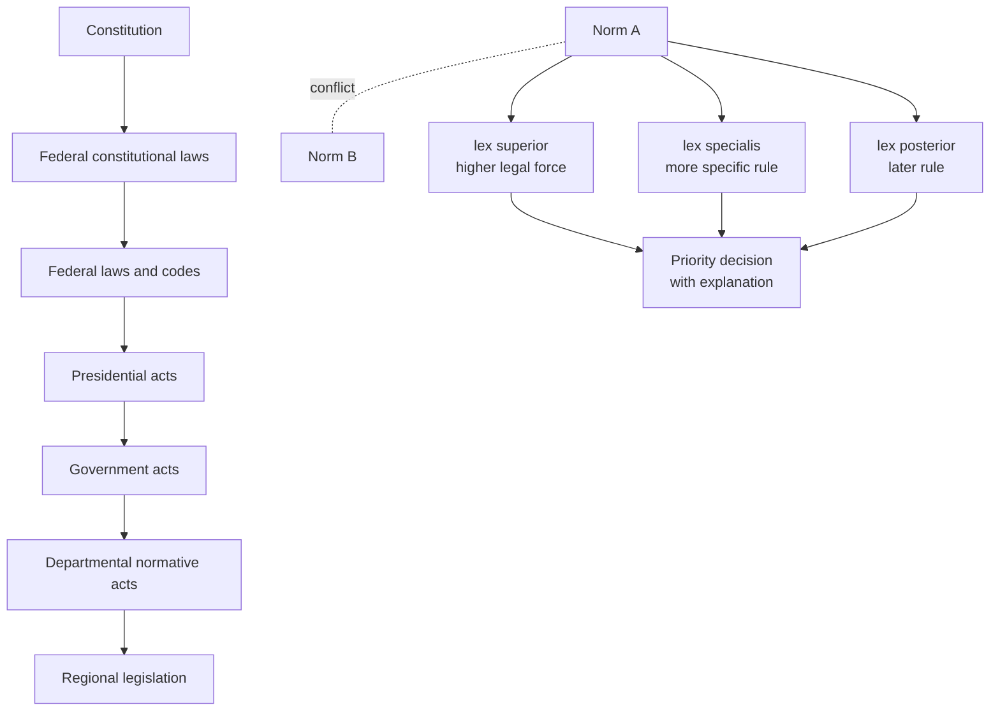

# 05-03 — RusLegalCore domain ontology and legal collision handling

## Scope

This group covers the Russian legal-domain ontology layer above LKIF, including Russian source hierarchy, federal structure, judicial interpretation, and conflict-resolution rules.

## Requirements

### 05-03-01 — Introduce a Russian legal-domain ontology layer over LKIF

The architecture MUST include a RusLegalCore-style layer that extends LKIF modules such as norm, role, and action for Russian legal specifics.

**Rationale:** The research states that LKIF was designed for the European legal tradition and does not fully cover Russian legal-system specifics.

### 05-03-02 — Model the hierarchy of Russian legal sources

The ontology MUST explicitly represent legal-force hierarchy, including the Constitution, federal constitutional laws, federal laws and codes, presidential acts, government acts, departmental acts, and regional legislation.

**Rationale:** Legal-force hierarchy is required for deterministic conflict resolution and authority-aware retrieval.

### 05-03-03 — Model federal competence boundaries

The ontology SHOULD represent the division of authority between the Russian Federation and its constituent subjects.

**Rationale:** The research identifies federal structure as a Russian-specific extension that LKIF alone does not cover.

### 05-03-04 — Represent judicial interpretation as graph entities

The graph SHOULD include legal-position nodes for Constitutional Court decisions, Supreme Court plenums, and other authoritative interpretations, linked to the norms they interpret.

**Rationale:** The research describes judicial practice as a layer connecting abstract norms to application and interpretation.

### 05-03-05 — Implement explicit supersession relationships

The graph MUST represent amendment, repeal, replacement, or override relationships through explicit edges such as `SUPERSEDES` or an equivalent typed relation.

**Rationale:** The research names `SUPERSEDES` as a required graph mechanism for legal collisions and temporal replacement.

### 05-03-06 — Encode legal collision maxims as deterministic graph logic

The architecture MUST support the maxims `lex superior`, `lex specialis`, and `lex posterior` as deterministic conflict-resolution logic.

**Rationale:** The research treats these maxims as necessary for resolving contradictions between norms.

### 05-03-07 — Keep conflict-resolution output explainable

When the system chooses one norm over another, it SHOULD expose which maxim and source evidence caused the priority decision.

**Rationale:** Legal graph behavior must be auditable; hidden priority rules would undermine legal evidence safety.

## Legal authority and conflict model

## Open proof needs

- Define the exact graph schema for legal force, specificity, and adoption/effective dates.
- Validate conflict examples on real Russian legal provisions, especially procurement-law special norms versus general civil-law provisions.
