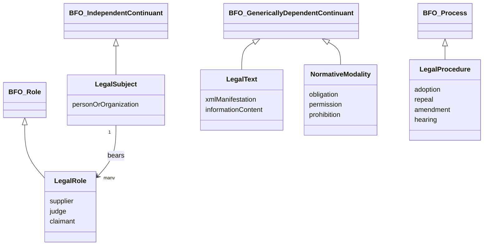

# 05-04 — BFO/GOST alignment and formal logic

## Scope

This group covers alignment of the legal-domain ontology with GOST R 59798-2021 and BFO 2020, plus formal representation needs beyond ordinary graph modeling.

## Requirements

### 05-04-01 — Align the domain ontology with GOST R 59798-2021 / BFO 2020

The architecture MUST map legal-domain classes to the upper-level BFO distinction between continuants and occurrents.

**Rationale:** The research states that GOST R 59798-2021 requires BFO as the top-level ontology for interoperability.

### 05-04-02 — Treat legal subjects as independent continuants

Physical persons, legal entities, and other legal subjects SHOULD map to `bfo:Independent Continuant` or a compatible project-local class beneath it.

**Rationale:** These entities preserve identity through time independently of specific proceedings or legal roles.

### 05-04-03 — Treat legal roles as dependent continuants

Roles such as supplier, judge, claimant, or defendant SHOULD map to `bfo:Role` as dependent continuants borne by independent entities.

**Rationale:** The research emphasizes that roles exist only under specific conditions and cannot exist without a bearer.

### 05-04-04 — Treat legal texts and modalities as generically dependent continuants

Legal text manifestations and normative modalities SHOULD map to generically dependent continuants, including information-content and directive-information entities where appropriate.

**Rationale:** Legal texts and prescriptive constructs can be copied or instantiated while preserving ideal informational identity.

### 05-04-05 — Treat legal procedures and amendment acts as occurrents/processes

Procedures such as legal adoption, repeal, judicial proceedings, and amendment events SHOULD map to `bfo:Process` or another occurrent subtype.

**Rationale:** These phenomena unfold over time rather than persisting as continuant objects.

### 05-04-06 — Support OWL 2 and Common Logic profiles where expressivity requires them

The ontology layer MUST account for OWL 2 and SHOULD define a Common Logic profile for temporal intervals, retroactivity, and part-whole relations that exceed ordinary OWL expressivity.

**Rationale:** The research states that GOST requires BFO representation not only in OWL 2 but also in Common Logic family formats, and that legal temporal axioms may need CL/FOL expressivity.

### 05-04-07 — Prevent BFO category errors through architecture checks

The architecture SHOULD include review or verification rules that flag likely category mistakes, such as modeling an event as a continuant or a legal role as an independent entity.

**Rationale:** The research warns that incorrect BFO mapping can create logical contradictions.

## BFO alignment sketch

## Open proof needs

- Check whether current architecture registry already has source-anchored BFO mappings.
- Validate the Common Logic requirement against actual GOST/BFO source text before turning it into an implementation commitment.
