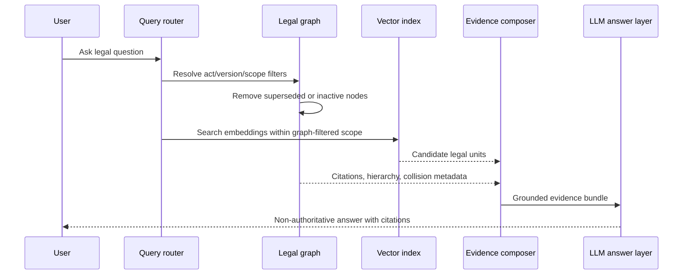

# 05-05 — Ontology-driven GraphRAG and storage

## Scope

This group covers implementation architecture for ontology-driven hybrid retrieval over a graph/vector store, including temporal versioning and graph-aware retrieval filters.

## Requirements

### 05-05-01 — Implement ontology-driven GraphRAG over the normalized legal graph

The retrieval architecture MUST use ontology and graph structure to constrain and explain retrieval rather than relying only on unstructured vector similarity.

**Rationale:** The research frames the target system as Ontology-Driven GraphRAG, where legal structure and semantics guide retrieval.

### 05-05-02 — Store embeddings at graph-node granularity

Vector representations SHOULD be stored on graph nodes corresponding to atomic legal units, not only at whole-document level.

**Rationale:** The research links structural atomization to improved search precision and describes embeddings as node properties.

### 05-05-03 — Combine topological graph filters with vector nearest-neighbor search

The retrieval layer SHOULD combine Cypher-like graph filters, such as validity and collision filters, with nearest-neighbor vector search such as HNSW.

**Rationale:** The research describes combining graph filters that exclude inactive versions with vector search in a single retrieval flow.

### 05-05-04 — Support temporal version aggregation for amendments

The storage model MUST avoid duplicating unchanged legal content when amendments occur and SHOULD create new nodes only for changed fragments.

**Rationale:** The research describes a CTV-style model that reuses links of unchanged articles while adding updated fragments.

### 05-05-05 — Exclude inactive legal versions during retrieval by default

Retrieval queries that ask for current legal status MUST filter out inactive or superseded versions unless the user explicitly asks for historical law.

**Rationale:** The research gives the current-status example as a core benefit of FRBR and temporal graph modeling.

### 05-05-06 — Keep generated answers citation-bound and non-authoritative

GraphRAG responses MUST remain grounded in retrieved legal units and SHOULD expose citations/provenance; generated text must not become independent legal authority.

**Rationale:** This is required by the project’s legal evidence guardrails and follows from the research’s emphasis on deterministic navigation and strict inference.

## Retrieval architecture sketch

## Open proof needs

- FalkorDB-specific vector, HNSW, and transaction claims require separate capability/runtime evidence before validation.
- Generated Cypher safety and answer correctness require independent test coverage.
