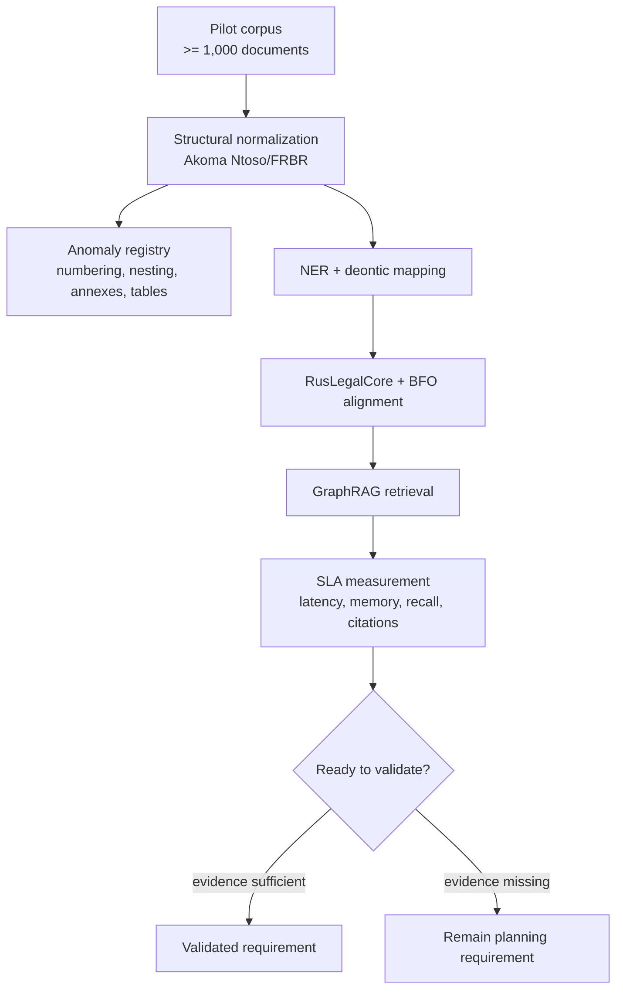

# 05-06 — Validation, scalability, and SLA

## Scope

This group covers validation requirements, scale assumptions, parser anomaly discovery, performance metrics, and context-compression requirements.

## Requirements

### 05-06-01 — Validate the full pipeline on a representative pilot corpus

The architecture MUST require an end-to-end pilot on at least 1,000 RusLawOD or equivalent Russian legal documents before claiming pipeline readiness.

**Rationale:** The research explicitly requires pilot testing on a subset of no fewer than 1,000 documents.

### 05-06-02 — Track parser and structural-normalization anomalies

The pilot MUST collect and classify anomalies such as missing numbering, unexpected legal-unit nesting, malformed tables, annexes, amendment formulas, and non-standard document layout.

**Rationale:** The research names parsing anomalies as a major risk for corpus-scale transformation.

### 05-06-03 — Define memory requirements for production-scale graph indexes

The architecture SHOULD define RAM/VRAM requirements for caching graph and vector indexes for a corpus on the order of 300,000+ documents.

**Rationale:** The research calls for explicit performance requirements covering memory for graph index caching.

### 05-06-04 — Define latency targets for multi-component legal queries

The architecture MUST define response-time targets for queries that combine graph traversal, legal collision handling, temporal filtering, and vector retrieval.

**Rationale:** The research calls out allowable response time for compound queries, including collision graph traversal.

### 05-06-05 — Define context-compression requirements for LLM-bound evidence

The retrieval layer SHOULD include context-compression methods such as TF-IDF, YAKE, or equivalent techniques to reduce generative-model load.

**Rationale:** The research explicitly names context compression as a requirement for reducing LLM burden.

### 05-06-06 — Separate architecture requirements from validated implementation claims

The project MUST treat these extracted requirements as planning evidence until backed by source, test, runtime, or real-document proof.

**Rationale:** Architecture research can guide design, but it does not by itself prove parser completeness, retrieval quality, legal correctness, or system scalability.

## Validation pipeline

## Candidate metrics

| Area | Candidate metric |
|---|---|
| Structural parsing | percent of documents with complete article/clause hierarchy |
| Provenance | percent of extracted assertions with source URI/IRI and text span |
| Deontic mapping | precision/recall on obligation, permission, prohibition |
| Temporal filtering | inactive-version exclusion correctness |
| Collision handling | explanation coverage for `lex superior`, `lex specialis`, `lex posterior` decisions |
| Retrieval | citation-bearing answer rate and evidence recall |
| Performance | p50/p95 latency for graph + vector queries |
| Resource use | RAM/VRAM footprint under representative index size |

## Open proof needs

- Establish current baseline metrics from repository tests or a new pilot harness.
- Decide which metrics become release gates versus research diagnostics.
